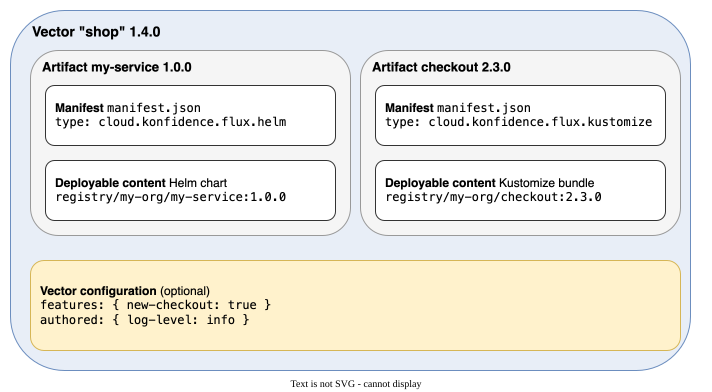
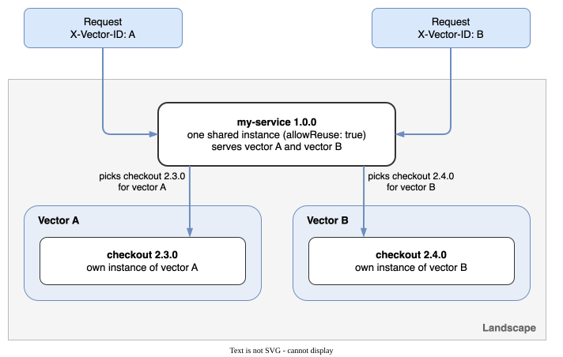
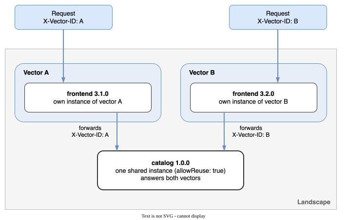

# Types of artifacts

<figure>
  
  <figcaption>A vector bundles artifacts. Each artifact bundles a manifest and its deployable content.</figcaption>
</figure>

An artifact is one deployable microservice packaged as an Open Component Model (OCM) component. A vector references artifacts by version, and a deployer renders each one into a landscape.

The component holds your deployable content, such as a Helm chart or a Kustomize bundle, and a small manifest. The manifest names the deployment method and states whether one running instance may serve several vectors. The authoring guides show both.

## Your landscape must offer a deployer for the type

Each artifact type deploys only where a deployer for it serves the landscape. Before you pick a type, check which deployer serves your landscape. See [Find out which deployer serves your landscape](../../deploy-operate/deployer/overview.md#find-out-which-deployer-serves-your-landscape).

## Konfidence deploys these artifact types

The following table lists each deployment method, the deployer that handles it, and where the deployer lives.

| Deployment method | Responsible deployer | Deployer repository |
| --- | --- | --- |
| [Kustomize](./kustomize.md) | Kubernetes deployer | [kubernetes-landscape-orchestrator](https://github.com/konfidence-project/kubernetes-landscape-orchestrator) |
| [Helm](./helm.md) | Kubernetes deployer | [kubernetes-landscape-orchestrator](https://github.com/konfidence-project/kubernetes-landscape-orchestrator) |

Deployers are extensible. To add a deployment method or a target platform, see [Extend & Customize](../../extend-customize/index.md).

<!-- TODO(fkasper): confirm the type identifiers. The deployer page says `cloud.konfidence.flux.kustomize` and `cloud.konfidence.flux.helm`; the orchestrator source accepts `kustomize.konfidence.cloud` and `helm.konfidence.cloud`. -->

## Choose whether vectors share one instance of your artifact

The manifest field `allowReuse` decides how many running instances of your artifact exist in a landscape. Set it explicitly for every artifact.

### How the deployer scopes an instance

The deployer derives the name of an instance from the artifact, its version, and the reuse policy:

- `allowReuse: false`: the instance name also includes the vector. Every vector gets its own copy, even for the same artifact version.
- `allowReuse: true`: the instance name does not include the vector. All vectors in the landscape that reference the same artifact version share one copy.

Changing `allowReuse` changes the instance name. The next deployment creates a new instance next to the old one.

### Why reuse exists

Without reuse, ten vectors that reference the same stable version of a service run ten copies of it. Reuse cuts that to one. It saves cluster resources and shortens activation. A new vector attaches to a running instance instead of starting its own.

Reuse also fits services you never want to duplicate, such as a shared backend with its own data.

### What reuse demands from your service

A shared instance receives requests from several vectors at once. Those vectors can reference different versions of your service's siblings. Vector A may pair `my-service 1.0.0` with `checkout 2.3.0`, while vector B pairs it with `checkout 2.4.0`.

<figure>
  
  <figcaption>One shared instance serves two vectors and picks the sibling that belongs to the vector of each request.</figcaption>
</figure>

The same holds when the shared instance sits downstream. Each vector's own frontend calls one shared `catalog` instance and passes its vector ID along.

<figure>
  
  <figcaption>Two vector-specific frontends fan in to one shared instance. The vector ID travels with every call.</figcaption>
</figure>

Your service must therefore treat every request on its own:

- Read `X-Vector-ID` from each request and forward it on every outbound call.
- Resolve sibling addresses, feature flags, and configuration per request through the vector data service. Cache them per vector ID, never per process.
- Hold no state that belongs to one vector.

### Choose `allowReuse: true` when

- Your service meets every demand above.
- The service is expensive to run, slow to start, or must exist only once.
- Vectors in a landscape mostly reference the same version of the service.

### Choose `allowReuse: false` when

- Your service loads configuration once at startup and keeps it for the lifetime of the process.
- Your service hard-codes sibling addresses or assumes fixed sibling versions.
- Your service stores or caches data that differs between vectors.
- You want each vector fully isolated, for example for load tests, or for destructive experiments.

## Next steps

- [Author a Kustomize artifact](./kustomize.md)
- [Author a Helm artifact](./helm.md)
- [Publish artifacts](./publish-artifacts.md) to package and push an artifact to a registry.
