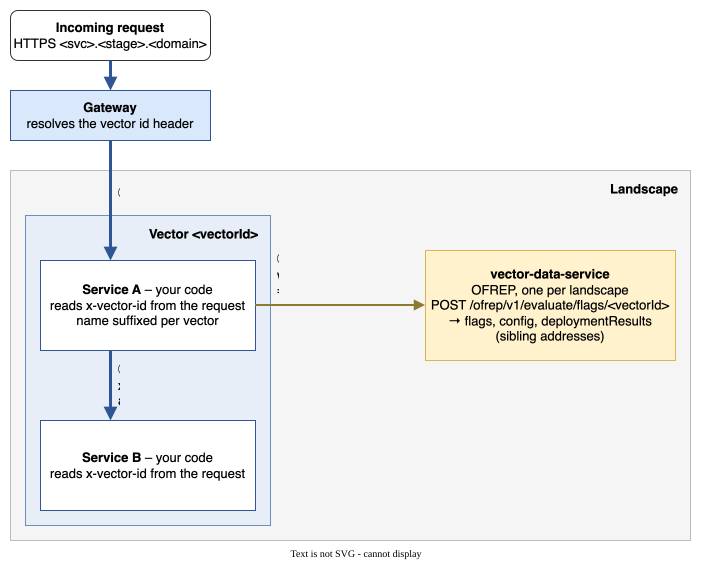

# Prepare your Application

The [Vector Concept](/docs/core-concepts/vectors-and-artifacts), introduced by Konfidence, requires you to modify your application. These changes let your services communicate with the other services in their vector. They also let your services receive [runtime configuration](/docs/develop-integrate/vector-data/overview) <!-- values like [feature flags]() -->.

<figure>
  
  <figcaption>The image depicts how your incoming request flows through konfidence and to your services</figcaption>
</figure>

## Prerequisites

Package your deployment code as a supported [Artifact](/docs/develop-integrate/artifact-types).

## Konfidence fits microservice applications

Konfidence targets distributed applications. Use it if your application meets these requirements:

* Your application uses a microservice architecture.
* You package each service as its own artifact.

Packaging and integration add overhead for your engineering team. Evaluate carefully whether Konfidence fits your use case.
