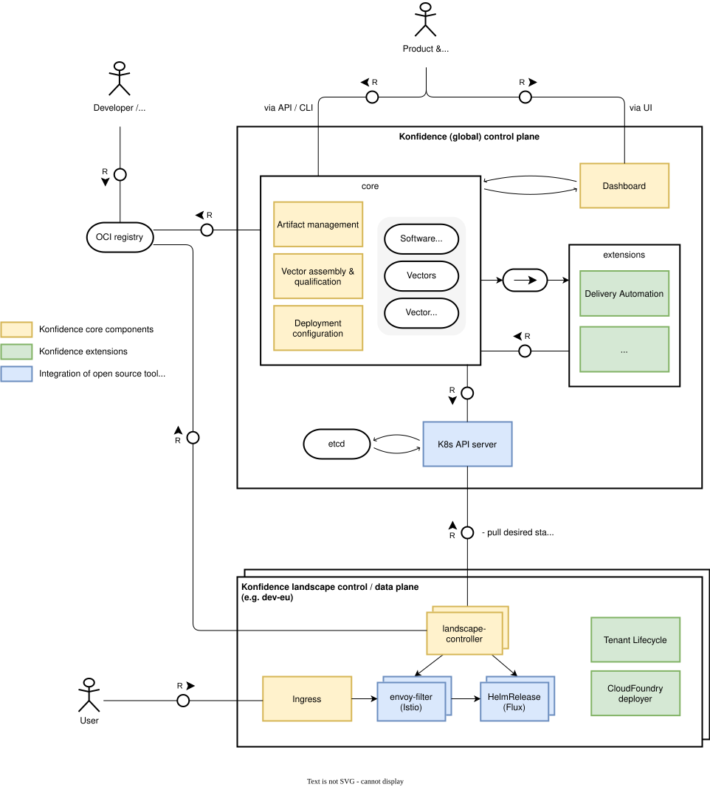

# ADR-0002: High-level architecture

<AdrHeader />

## Context / Requirements

This document outlines an initial high-level architecture for *Konfidence*. It is inspired by the [Kubernetes Operator pattern](https://kubernetes.io/docs/concepts/extend-kubernetes/operator/).

The feature set is based on outcomes from the initial project workshops.

## Considered solutions

The architecture is modeled after patterns found in Kubernetes and Gardener, where the system is split into a *control plane* and a *data plane*. This separation improves scalability and maintainability.

### Ubiquitous language

To support clear communication across teams, Konfidence defines a shared terminology:

- Control plane: The Konfidence control plane is named _global control plane_; this emphasizes that it can manage multiple data planes and can be operated in a global manner.
- Data plane: The Konfidence data plane is named _landscape control plane_ which emphasizes that it represents one (or more) development or production environments of the actual application which is managed by Konfidence.
- Software artifacts: Result of developers work such as Docker images or Helm charts.
- Vector: An immutable set of (versionized) software artifacts
- Configuration: Parameters used to instantiate a vector
    - Product specific: feature-toggles, launchpad, etc.
    - Environment specific: replicas, 3rd-party service, etc.
- Vector deployment: The instantiation of a vector (including configuration) into a specific environment.

### Pull-based architecture

The communication between global and landscape plane is based on a pull pattern and implements a reconciliation loop (i.e. operator pattern). The `landscape-controller(s)` constantly pulls its desired state from the control plane and reconciles it with the current state of the data plane. This inversion of control allows for better scalability and flexibility, as the data plane can be deployed in different environments without having to change the control plane.

**Agents:**

- Konfidence (global) control plane:
    - Watches OCI registry for new versions of software artifacts
    - Provides core functionality to assemble a vector (includes artifact management, vector assembly and qualification)
    - Provides the (deployment) configuration specific for each landscape control plane (for example: apply vector `xyz` to landscape `dev-eu`)
    - The pluggable architecture allows to implement extensions (via eventing)
    - API first approach, i.e. the control plane is managable via API, but Konfidence brings dashboard as well

- Konfidence data plane aka landscape control plane:
    - Pull desired state from global control plane, coordinates deployment, creates routing resources
    - This is implemented by multiple controllers and their CRDs
    - The data plane could be deployed on the same K8s cluster (e.g. B2C scenario) or on a different cluster (e.g. multi-tenant, B2B scenario)
    - The diagram shows an example integration of Istio for (vector) routing and Flux as deployment operator

Depending on the descriptor format of a vector deployment, the API server could be the K8s API server (if we use CRDs to describe the vector deployment) or a custom API server (if we use open component model (OCM) for example).

High-level architecture of Project Konfidence

**Actors:**

- Product & release manager:
    - defines _the application_ which is managed by Konfidence (i.e. what software artifacts should be deployed, and where)
    - provides product-specific configuration (e.g. feature toggles, etc.)
    - triggers promotions (i.e. moves vectors from development to production)
- Developer & DevOps:
    - creates and uploads software artifacts to OCI registry
    - uploads metadata about software artifacts to Konfidence control plane
    - provides environment-specific configuration (e.g. replicas, etc.) to Konfidence control plane
- User: consumes the application

## Decision & Rationale

### Design decisions

Based on the outlined architecture, the main design decisions of Konfidence are the following:

1. The creation of a vector and its deployment is a two-step process and **separated into global and landscape control plane**.
    - Separation of concerns: Decoupling of application management (vector assembly) and deployment (vector deployment).
    - It is not necessary to have a global control plane at all; a landscape control plane can also deploy vectors from a 3rd-party source.
1. The communication between global and landscape control plane is based on a **pull pattern** and implements a reconciliation loop (i.e. operator pattern).
    - The global control plane must not even know about the existence of a specific landscape control plane.
    - No credentials neccessary to access the landscape control plane; this is esspecially important for restricted data centers like sovereign clouds.
    - The reconciliation loop ensures that the desired state is always maintained, reducing the need for manual intervention.
1. Providing **extension points** to allow for customizations and extensions of the core functionality.
    - Keeps the core clean.
1. Using **open source software** where possible and feasible.
    - Leverage existing solutions to reduce development effort and increase maintainability.
    - Potential candidates (decision will be covered by other ADRs) include OCM as descriptor language, FluxCD as deployment operator, Istio for routing.

### Open points

This ADR describes the _big picture_ of Konfidence, a lot of details are not depicted here and will be covered by other ADRs, especially:

- How to sync the global and landscape control planes?
- What are the core entities of Konfidence, and how do they interact?
- Which Konfidence concepts and entities are K8s native (i.e. covered by K8s CRDs) and which are not? In other words: Where can Konfidence be configured by K8s API and where not?
- It is not defined how the extension mechanism is working in detail. Eventing is proposed in this ADR because it is a good way to decouple transmitter and receiver.
