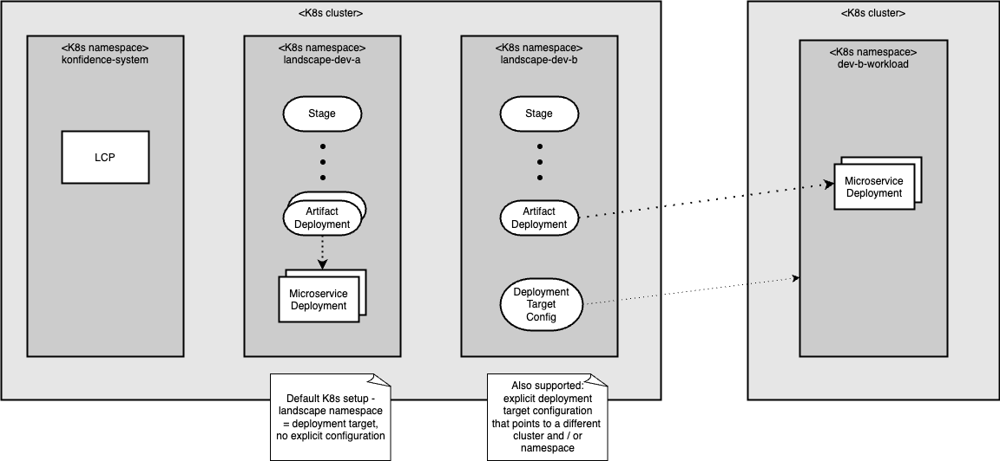

# ADR-0007: Multi-landscape support and namespace separation

<AdrHeader />

## Context

The Landscape Control PLane (LCP) is responsible for managing deployments within a landscape.
In a standard K8s setup, the LCP is installed on the same cluster as the workloads it manages, but for other deployment targets such as Cloud Foundry, or in scenarios where a landscape has multiple deployment targets that could be separate K8s clusters, the LCP is not installed on the same cluster as the workloads.
Furthermore, Konfidence should impose no restriction on the number of landscapes that can be deployed to a single cluster.

To enable these use cases in efficient way, a single installation of the LCP should be able to manage multiple landscapes, whether their workloads are deployed to the same cluster, other clusters or completely different deployment targets.

## Considered Solutions

- Separating landscapes by using different K8s namespaces
- Separating landscapes by using labels
- Separating landscapes by using a custom property defined in the Kondifdence CRDs

## Decision

A single installation of the LCP supports multiple landscapes, allowing it to manage deployments across different namespaces, clusters or other deployment targets.

Each landscape is represented by a separate **namespace** within the LCP's cluster, ensuring that resources for each landscape are isolated from one another.

The LCP is deployed once in its own namespace named `konfidence-system`.

The LCP does not enforce any naming pattern on the namespace names.
The mere presence of a Stage resource is sufficient for the landscape operator to treat the namespace as a landscape.

If no additional configuration is provided, artifacts that target K8s are deployed to the same namespace that contains the Stage resource (and the other Konfidence custom resources belonging to the landscape).
However, it is possible to optionally configure a different namespace or even cluster as the deployment target for K8s deployments.
For non-K8s deployment targets, such a deployment target configuration is always required.
The deployment target configurations and additional landscape-specific configuration and secrets are also stored in the landscape's namespace.

## Consequences

- The landscape operator must reconcile resources from multiple namespaces and detect relevant namespaces based on the presence of a Stage resource
- Managing multiple landscape namespaces with one LCP installation leads to a higher number of custom resources in a single K8S API server. This needs to be considered in other design decisions and should be documented in the documentation and best practices

