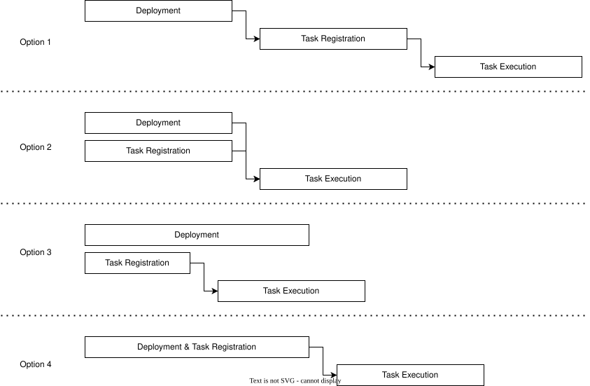
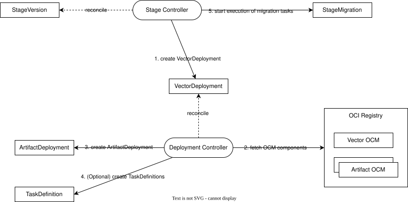
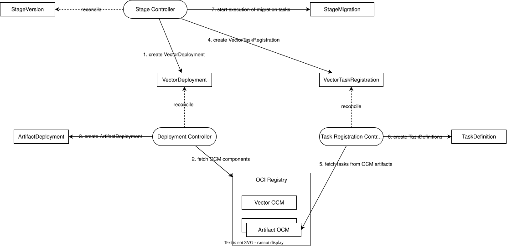
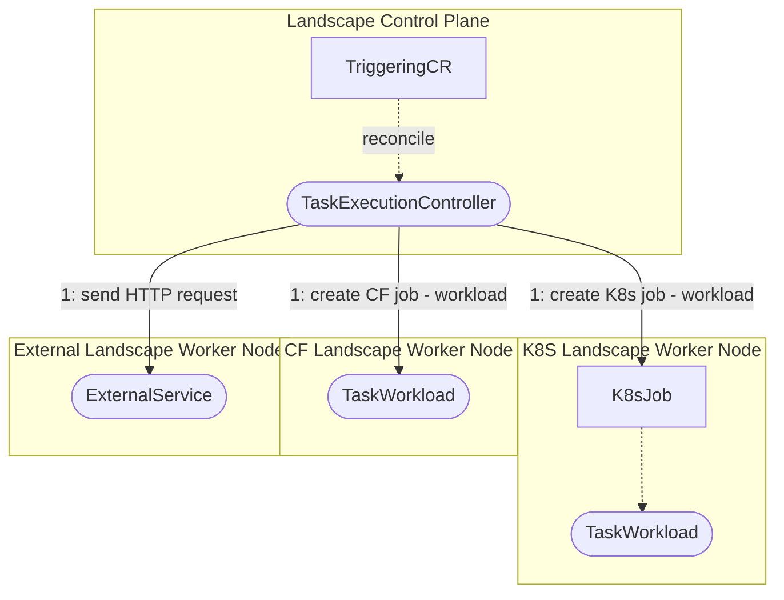
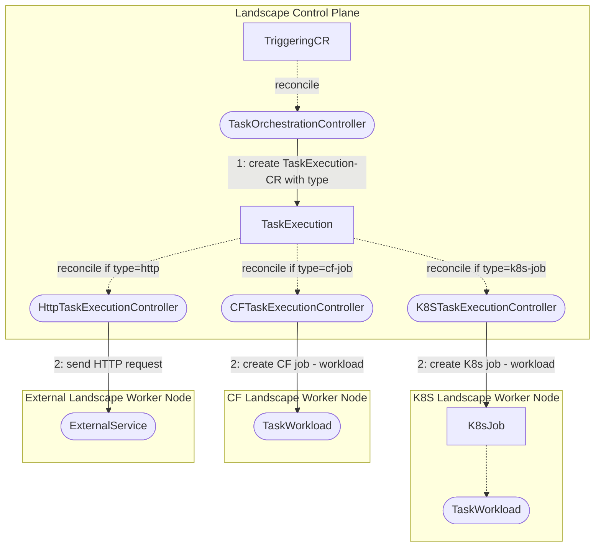
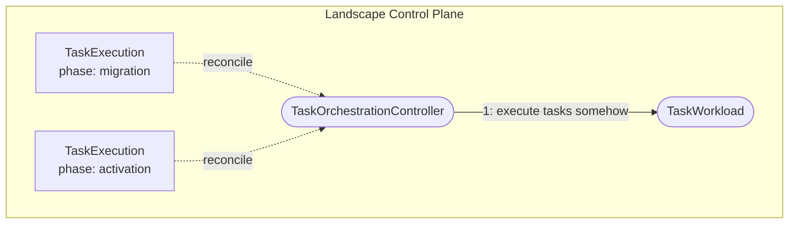
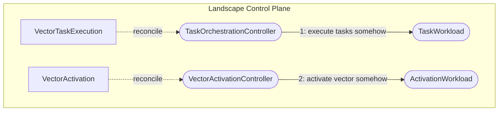
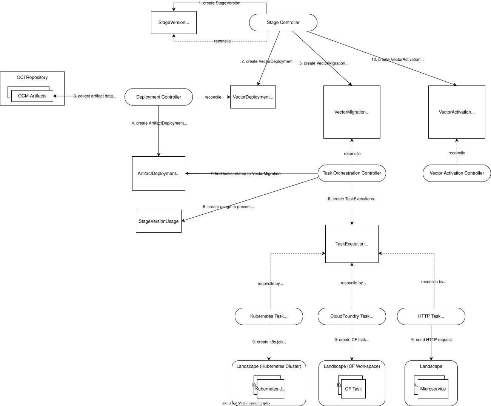

# ADR-0008: Task engine

<AdrHeader />

## Context
In a modern microservice-based Kubernetes platform, services often need to run auxiliary tasks such as database migrations, cache warm-ups, or search index updates. 
These tasks are not part of the main application runtime. You must define and execute them in a controlled, repeatable way, often tied to the service lifecycle (for example, during deployment or promotion).
Because microservices are decentralized, each service can define its own tasks. The Konfidence platform must provide a standardized way to define tasks declaratively and register them for centralized discovery, orchestration, and execution.
This ADR describes how individual services define tasks, register them with the platform, and make them available for execution.

### Requirements

Regardless of the underlying mechanism, task definitions must satisfy a set of shared functional and operational requirements.

**1. Declarative Task Metadata**

Each task must include a structured definition with at least:
* Unique name within the microservice context
* Vector Lifecycle phase: `Deployment`, `Migration`, or `Activation`
* Task type (for example, `KubernetesJob`, `HTTPRequest`)
* Execution details: how to execute the task (for example, container image + command, job spec, script reference)
* Dependencies: prerequisite tasks that must complete before this task runs
* Inputs/parameters to customize execution

**2. Discoverability**

The platform must be able to reliably discover all available tasks for a given service. This discovery must:
* be automatable and consistent across all services
* work in multi-cluster (and multi-environment) setups
* integrate with the CI/CD and deployment workflow

**3. Immutability**

Tasks must keep their identity immutable. If a task exists in version v1 of a microservice and also in version v2, the definition must be *exactly* the same in semantics and behavior.
This ensures predictable, deterministic execution, regardless of when or where the task runs.
In the future, the platform may verify this constraint to prevent changes that could cause unexpected behavior or failures (for example, via ETags).

**4. Runtime Isolation**

Tasks should be executable independently of the microservice runtime. Ideally, they are:
* self-contained (e.g., in their own containers or scripts)
* executed as Kubernetes Jobs or similar isolated units
* not dependent on long-lived application processes

**5. Task Dependencies**

Tasks can have dependencies to each other in a vector, even across different microservices.
Tasks have to be executed in order based on their dependencies.

**6. Idempotency**

Since Kubernetes follows an eventually consistent model, tasks may be triggered multiple times due to failures or retries in the deployment process.
Task implementations must therefore be idempotent, ensuring that repeated executions do not cause unintended side effects or inconsistent state.


## Considered Solutions
The overall solution for task definition and registration is composed of multiple interdependent technical decisions.
To ensure clarity and to avoid mixing different concerns, we evaluate each aspect individually.
As a result, each considered solution in this section addresses a specific part of the system rather than the whole.
While this modular approach may make the overall design less immediately clear, the [Decision](#decision) section will present the fully composed architecture proposal, integrating all selected sub-decisions into a cohesive solution.


### Lifecycle phases
In order to execute the tasks at a point in the service lifecycle we need to think about the lifecycle phases and define in which phases the tasks could be executed.
This also raises the question if these phases are relevant only for the runtime architecture or also for the deployment architecture, and how much those two are intertwined.

#### Option 1 (preferred)
Hardcoded, predefined phases in the service lifecycle. Initially, the minimum required phases must be:

- Deployment-phase: Deploy the vector's artifacts to the target environment
- Migration-phase: Execute any necessary tasks to match the prerequisites of the new software version (for example, database migrations, configuration updates, runtime preparations, etc.)
- Activation-phase: Activate the vector in the target environment. Route traffic to new artifact deployments

The only phase where tasks are executed would be the Task-phase. The user of Konfidence has the opportunity to register tasks for this phase. The other phases (Deployment, Activation) are managed by Konfidence internally.

#### Option 2
Hardcoded but more predefined phases.

- Pre-Deployment-phase: Execute any necessary tasks before deployment
- Deployment-phase: Deploy the vector's artifacts to the target environment
- Migration-phase: Execute any necessary tasks to match the prerequisites of the new software version (e.g. database migrations, configuration updates, runtime preparations, etc.)
- Activation-phase: Activate the vector in the target environment. Route traffic to new artifact deployments
- Post-Activation-phase: Execute any necessary tasks after activation

In this approach it could be possible to execute tasks at any point of the service-lifecycle to gain more flexibility in performing preparation for the service deployment.
Maybe there are some phases which are reserved for Konfidence and no custom tasks will be executed at that phase (maybe reserved phases: deployment, activation)

#### Option 3
Loosely coupled phases which could be added and ordered by the user of Konfidence.

Konfidence need at least these two phases which are hardcoded and fixed.

- Deployment-phase: Deploy the vector's artifacts to the target environment
- Activation-phase: Activate the vector in the target environment. Route traffic to new artifact deployments

This approach would lead to a complex solution with many unknown edge cases and is hard to develop/stable.

### Task Definition
Task definition describes which executable tasks a service provides and how they can be discovered.
These tasks can be anything from simple scripts to complex workflows, and they need to be defined in a way that allows the platform to understand their purpose, parameters, and execution context.
We have identified two potential mechanisms for services to define these tasks.


#### 1. HTTP-based Task Definition
Each microservice exposes a standardized HTTP endpoint (e.g., `GET /task-registration`) that returns a list of available tasks in a defined JSON structure.
This is a flexible, runtime-based approach where task definitions can be programmatically generated or composed by the application.

The exact response schema is still to be defined, but it could look similar to this:

```json5
{
  "tasks": [
    {
      "name": "foo",
      "dependsOn": [{"taskName": "bar"}],
      "phases": ["MIGRATION"],
      "taskSpec": {
        // ...
      }
    },
    {
      "name": "bar",
      "phases": ["MIGRATION"],
      "taskSpec": {
        // ...
      }
    },
    // more tasks ...
  ]
}
```

#### 2. OCM-based Task Definition
Leveraging the Open Component Model (OCM), tasks can be defined as OCI artifacts referenced in the component descriptor of a service's OCM component version.
This integrates well the OCM-based deployment model of Konfidence and allows decoupling task execution from service runtime.

In this ADR, we do not aim to decide the exact method for defining tasks in OCM, as this is primarily an implementation detail.
However, we identified two main approaches to defining tasks in OCM:
* tasks as resources inside the main service component
* or tasks as individual components which are referenced in the main service component.

##### 2.1 Tasks as Resources (preferred)
Each task is defined as a resource in the OCM component descriptor of the main service.

```yaml
components:
- name: example.konfidence.cloud/example-project/my-service
  version: 0.0.1
  resources:
  - name: my-service-image
    version: 0.0.1
    type: ociImage
    access:
      type: ociArtifact
      imageReference: localhost:5100/artifacts/my-service:0.0.1
  - name: my-service-task-1
    version: 0.0.1
    type: konfidence.cloud/task
    access:
      type: ociArtifact
      imageReference: localhost:5100/artifacts/my-service-task-1:0.0.1
  - name: my-service-task-2
    version: 0.0.1
    type: konfidence.cloud/task
    access:
      type: ociArtifact
      imageReference: localhost:5100/artifacts/my-service-task-2:0.0.1
```

##### 2.2 Tasks as individual Components
Each task is a separate component version, which can be referenced in the component descriptor of the main service component version:

```yaml
# my-service-task-1 component descriptor
components:
- name: example.konfidence.cloud/example-project/my-service-task-1
  version: 0.0.1
  resources:
  - name: my-service-task-1
    version: 0.0.1
    type: konfidence.cloud/task
    access:
      type: ociArtifact
      imageReference: localhost:5100/artifacts/my-service-task-1:0.0.1
```

```yaml
# my-service component descriptor
components:
- name: example.konfidence.cloud/example-project/my-service
  version: 0.0.1
  resources:
  - name: my-service-image
    version: 0.0.1
    type: ociImage
    access:
      type: ociArtifact
      imageReference: localhost:5100/artifacts/my-service:0.0.1
  componentReferences:
  - componentName: example.konfidence.cloud/example-project/my-service-task-1
    name: my-service-task-1
    version: 0.0.1
  - componentName:  example.konfidence.cloud/example-project/my-service-task-2
    name: my-service-task-2
    version: 0.2.0
```

Alternatively, the task could be referenced directly in the component descriptor of the vector, thus making it completely independent of the main service component version:

```yaml
# vector component descriptor
components:
- name: example.konfidence.cloud/example-project/vector/dev-eu
  version: 0.1.0
  labels:
    - name: konfidence.cloud/vector-id
      value: 01904be8-bae3-ae70-e4d6-78af41d7e0a2
      version: v1
  componentReferences:
  - componentName: example.konfidence.cloud/example-project/service1
    name: service1
    version: 0.0.1
  - name: service2
    version: 0.2.0
    componentName:  example.konfidence.cloud/example-project/service2
  - componentName: example.konfidence.cloud/example-project/my-service-task-1
    name: my-service-task-1
    version: 0.0.1
  sources: []
  resources: []
```

### Task Registration

Task registration is the process of making the defined tasks available to the Konfidence platform for discovery and execution.
There are many questions to consider regarding task registration, like how the task registration is integrated into the deployment process, when it happens, and which controller is responsible for it.
In this section, we will explore the different options for task registration, and how they can be implemented in the Konfidence platform.


#### When does tasks registration happen?

There are multiple options for when task registration occurs in relation to the deployment of microservices.


##### Option 1 - Sequential Task Registration
In Option 1, task registration happens after the deployment of all artifact deployments is completed.
This ensures that all microservices are up and running before any tasks are registered.
With this option, it is possible to use the HTTP-based task definition approach, as the microservices are guaranteed to be available to respond to the registration request.

##### Option 2 - Parallel Task Registration, late execution
In this approach, task registration occurs in parallel with the deployment of artifact deployments.
This means that as soon as a new vector is applied to a stage, the task registration process starts (even while microservice deployment in still ongoing).
This allows for faster task registration, but requires that the task definitions are available without a running instance of the microservice.

##### Option 3 - Parallel Task Registration, early execution
Option 3 is similar to Option 2, but now the task execution can start immediately after the task registration is completed.
This means that tasks can be executed as soon as the registration is complete and all task dependencies are satisfied.
This approach is particularly useful for tasks that are not dependent on the microservice being fully deployed, such as database migrations.

Option 2 and 3 are not mutually exclusive.
The task metadata could define different task types to decide when the task is ready for execution.

##### Option 4 - Combined Task Registration, late execution (preferred)
Include task registration in the deployment artifact. This way, the platform connects to the OCI registry only once and gathers all tasks while fetching the deployment artifact.
The deployment artifact defines both the deployment and its tasks for the new vector.


#### How to store task registration?

##### Option 1 - Standalone Thick Task Registration
Each task is registered as a separate `TaskDefinition` resource in the Landscape Control Plane.
This resource contains all necessary metadata about the task, including its name, type, dependencies, and execution details.
With thick tasks registration, the `TaskDefinition` resource is fully self-contained and does not require any additional information from any other systems (like OCI repository).

##### Option 2 - Standalone Thin Task Registration
In this approach, the custom resources only store limited metadata about the tasks, such as its name and dependencies.
The actual execution details (e.g., type, container image, command) are omitted and must be fetched again from the OCI registry before execution.
This can be realised by creating a `TaskExecutionPlan` resource that contains a graph-like structure of tasks and their dependencies, but without the full task definition.

##### Option 3 - No Task Registration
Theoretically, task registration inside the Landscape Control Plane is not necessary at all.
Instead, the task definitions could be fetched directly from the OCI repository whenever they are needed.
However, this approach has several drawbacks and we do not recommend it:
* It does not provide a clear separation of concerns between task definition and task execution, which can lead to confusion and complexity in the system.
* It does not allow for easy tracking of task execution history or status, as there is no central record of registered tasks.
* It does not provide a clear way to handle task dependencies or execution order, which can lead to issues with task execution and orchestration.

##### Option 4 - Combined Thick Task Registration (preferred)
Register each task in the `ArtifactDeployment` resource in the Landscape Control Plane. This resource contains the deployment and all necessary task metadata, including name, type, dependencies, and execution details for the new vector.
This approach means the `ArtifactDeployment` resource is used in two phases: deployment and tasks.

#### Which controller is responsible for Task Registration?

The following flow charts illustrate how the Landscape Control Plane handles task registration.
This process is independent of the task definition mechanism and is triggered by assigning a new vector to a stage.
Again, there are multiple options for how task registration can be implemented and which controller is responsible for it.

##### Option 1 - Task Registration by Deployment Controller (preferred)
First option is to register tasks as part of the deployment process.
The deployment controller needs to fetch the OCM images anyway for creating the `ArtifactDeployment` resources.
This creates a synergy effect, as the deployment controller can also register the tasks at the same time.




##### Option 2 - Task Registration by separate Task Registration Controller
In this option, a separate controller is responsible for task registration.
That way, task registration can be decoupled from the deployment process.



### Task Execution
Task execution runs the tasks and workload in a target system.
How tasks run depends on whether and how Konfidence registers and preserves them.
This section covers only the main decisions Konfidence must make.

#### How will the tasks be orchestrated/executed?
Several options exist to orchestrate and execute tasks. This section focuses on two solutions that fit Konfidence’s needs.

##### Option 1
A TaskExecutionController retrieves the task definition and creates the workload directly in the target system.



This approach is simple but not really suited for extensions, and it requires Konfidence to provide implementations for all supported task types.


##### Option 2 (preferred)
A TaskOrchestrationController retrieves the task definition, extracts the required information, and creates a TaskExecution CR. Different controllers reconcile this CR based on the task type.
For example, a K8sTaskExecutionController could reconcile a TaskExecution CR with type `k8s-job` and create the workload on the target system.



This approach comes with a bigger footprint but is great for extensibility. The user could create their own task types and write an own controller for them.

#### Where could the tasks be hooked in?
Tasks can be used in any part of Konfidence. The level of flexibility and customization for the user greatly affects the platform design.
There are many ways to design task usage in Konfidence. For simplicity, this section focuses on two opposite solutions. A hybrid of both is also possible.

##### Option 1
A generic approach uses tasks for all or most software lifecycle phases through a TaskExecution CR with a `phase` property.
This CR triggers task execution via one controller, which delegates the workload for execution.


The generic approach is highly extendable and allows for user customizations in any thinkable phase.

##### Option 2 (preferred)
If Konfidence should follow a predefined process with less user customization, one solution is to create an `Execution` CR for each phase to trigger its workload.
This also supports phases where no tasks need execution, such as internal Konfidence phases.



#### Open-source solutions
During our market research, we evaluated different open-source tools as task engines. Open-source solutions like Tekton or Argo Workflows do not meet our needs.
They lack features such as:
* Multi-cluster handling
* Platform-independent job execution (CF jobs, HTTP requests, etc.)
* Small footprint, lightweight installation

## Decision
The final architecture vision combines multiple interdependent decisions to provide a robust task orchestration engine for the Konfidence platform.
In the above sections, we marked all decisions with a suffix of "preferred" to indicate our current direction.
The following illustration summarizes the complete architecture vision, integrating all selected sub-decisions.



The Deployment Controller collects deployment artifacts from an OCI-based OCM repository and generates an `ArtifactDeployment` resource.
Previously, this resource contained only a deployment specification describing how to deploy the artifacts in the target environment. It now also includes task definitions.
These tasks are part of the logical migration path of the microservice and can include any logic to run before the new microservice version activates. Typical examples are database migrations, cache warm-ups, or search index updates.

After the `VectorDeployment` resource reaches its `Ready` state, the stage controller creates a `VectorMigration` resource.
This resource represents the migration phase of the vector and is reconciled by a new Task Orchestration Controller. Its purpose is to identify all tasks in the `VectorMigration` and orchestrate their execution.
To safeguard the in-progress state, the controller creates a `StageVersionUsage` resource to prevent vector deletion while migration tasks run.
It resolves task dependencies and creates `TaskExecution` resources in the correct order. Each task execution includes inputs, specs, and a defined type so that the appropriate execution controller can handle it.

Specific Task Execution Controllers run these tasks, depending on the task type.
For Kubernetes tasks, a new Kubernetes Task Execution Controller creates a job in the target Kubernetes cluster and monitors its execution.
This concept can also support other task types, such as CloudFoundry tasks or HTTP tasks.

Finally, once all tasks in the `VectorMigration` complete successfully, the Stage Controller continues the vector lifecycle by initiating the activation phase.
The details of the activation phase will be covered in a separate ADR, but it is **not** part of the task engine.

## Consequences
* **Platform-native integration:**
The use of OCM-based task definitions integrates seamlessly with Konfidence’s existing deployment model, providing a strong connection between deployment artifacts and their associated tasks.
Tasks defined as OCI resources and versioned as part of component descriptors support immutability guarantees and ensure tasks remain consistent across environments.
The chosen lifecycle phase separation and task registration timing enables deterministic orchestration and execution of tasks as part of the vector lifecycle.

* **Increased complexity in task authoring:**
Developers must learn and follow a well-defined task model and structure task artifacts correctly. This may create an onboarding hurdle, which can be reduced through clear documentation, examples, and tooling. The goal is to provide a declarative, consistent way to define tasks that integrate easily into CI/CD workflows.

* **Extensible task runtime:**
The architecture supports extensible task execution, enabling various task types (for example, Kubernetes jobs, HTTP requests) and custom implementations. Because tasks are registered from OCI artifacts rather than service availability, this approach works reliably in multi-cluster and air-gapped environments.

* **Centralized information in ArtifactDeployment:**
The `ArtifactDeployment` resource is the single source of truth for both deployment metadata and associated tasks. Because this resource is already reused in the deployment process, it also enables automatic reuse of task information across deployments.

* **Sequential lifecycle phases with clear responsibilities:**
The deployment process has three sequential lifecycle phases: deployment, migration, and activation. Only the migration phase runs tasks, while deployment and activation are handled internally by the Konfidence platform. This separation ensures clean orchestration boundaries and allows tasks to run at the most appropriate point in the lifecycle. Deployment and activation can still allow some extensibility, but only at the platform level, not the microservice level.
