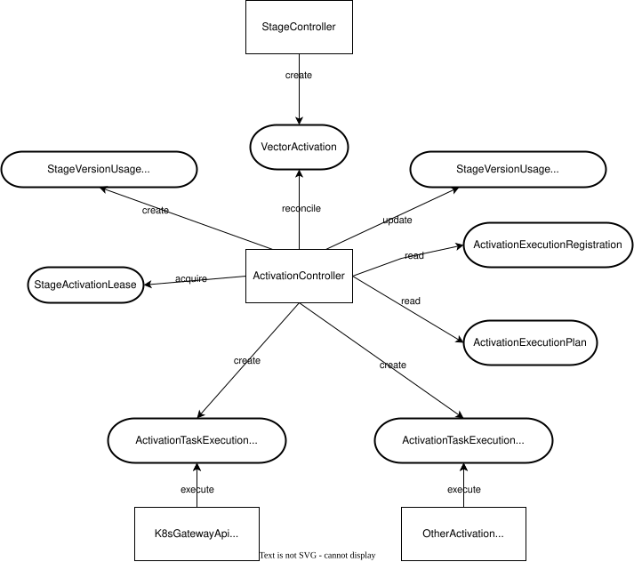
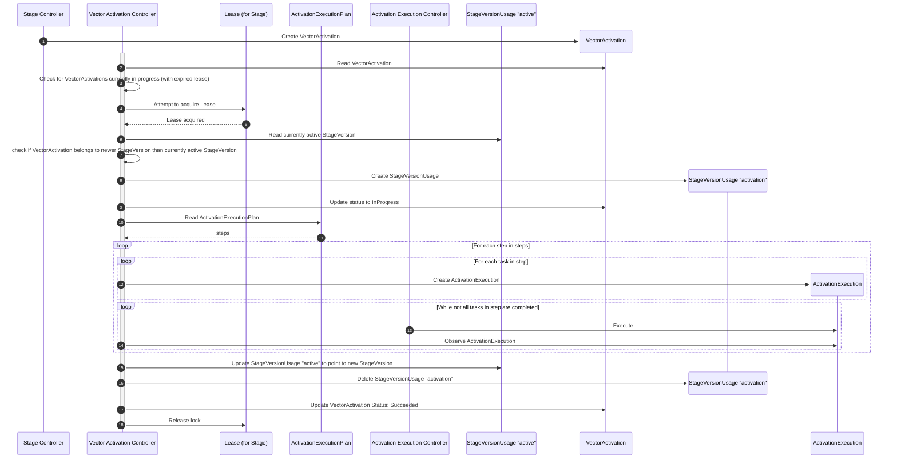

# ADR-0012: Activation controller

<AdrHeader />

## Context

After a new vector has been successfully deployed and any associated migration tasks have been completed (as per [ADR-0008 Task Engine](./adr-0008-task-engine.md)), the new software version is running but not yet serving live traffic. The final step in the lifecycle is the **activation**: a controlled and reliable process of switching traffic to the newly deployed artifacts.

### Requirements

1.  **Declarative Activation:** The activation process must be triggered declaratively by creating a Kubernetes custom resource. The system will then reconcile the state of the landscape to match the desired activation.
2.  **Concurrency Control:** The system must strictly enforce that only one activation process for a given `Stage` can run at a time. This prevents race conditions where a slower, older activation could overwrite a faster, newer one.
3.  **Extensibility:** The platform must support various routing and service mesh technologies (e.g., Gateway API, Istio, CloudFoundry, etc.). The architecture must allow for new activation mechanisms to be added without modifying the core activation controller.
4.  The system must prevent the underlying `StageVersion` and its artifacts from being deleted or modified while an activation is in progress.
5.  Dependencies between activation tasks must be manageable, allowing certain tasks to run only after others have completed successfully. This includes the ability to define tasks that must run before or after others, as it must be possible to define dependencies in both directions with predefined tasks that shipped with the platform.


## Considered Solutions

### Option 1: Generic task orchestration for both migration and activation (discarded)

1.  **Vector Activation Controller:** A high-level controller that manages the overall activation process, including locking and lifecycle tracking. It does not interact with routing or other activation resources directly.
2.  **Task Orchestration Engine:** A generic orchestration engine that creates task executions, respecting dependencies and execution order. This engine is shared between migration and activation processes.
3.  **Task Execution Controllers (Executors):** Specialized controllers that handle the actual work of modifying routing resources for a specific technology, or other activation tasks. They are implemented in the same way as migration task execution controllers.

The `Vector Activation Controller` creates a `TaskExecutionPlan` CR that contains a list tasks to be executed, including their type and dependency relationships.
The task list is compiled based on `ActivationTaskRegistration` CRs found in the landscape's namespace and the konfidence-system namespace.
The `Task Orchestration Engine` controller reconciles the `TaskExecutionPlan` CR and creates the `TaskExecution` CRs with the correct type and in the correct order based on the dependency tree.
For each task type, a corresponding `Task Execution Controller` watches for `TaskExecution` CRs of its type and performs the necessary actions to complete the task, e.g. updating Gateway API HTTPRoute resources.


ActivationTaskRegistration CR example:

```
apiVersion: landscape.konfidence.cloud/v1alpha1
kind: ActivationTaskRegistration
metadata:
  name: activationtaskregistration-sample
spec:
  type: custom-k8s-activation
  spec: ""
  suceeds:
    - activation-A
    - activation-B
  precedes:
    - activation-C
```

TaskExecutionPlan CR example:

```
apiVersion: landscape.konfidence.cloud/v1alpha1
kind: TaskExecutionPlan
metadata:
  name: taskexecutionplan-sample
spec:
  tasks:
    - type: activation-A
      spec: ""
    - type: activation-B
      spec: ""
    - type: custom-k8s-activation
      spec: ""
      dependsOn:
        - activation-A
        - activation-B
    - type: activation-C
      spec: ""
      dependsOn:
        - custom-k8s-activation
```


#### Advantages

- reuse of the task orchestration logic
- offers a high degree of extensibility for new activation mechanisms
- enables complex dependency management between activation tasks (which can also be a disadvantage)

#### Disadvantages

- the dependency management is spread across all ActivationTaskRegistration CRs, making it harder to understand and configure the full activation process with all dependencies
- future diverging requirements for migration and activation tasks could lead to complexity in the shared orchestration engine


### Option 2: Dedicated activation task orchestration based on a ActivationExecutionPlan CR (preferred)

1.  **Vector Activation Controller:** A high-level controller that manages the overall activation process, including locking and lifecycle tracking. It reads ActivationTaskRegistration CR(s) and optionally an ActivationExecutionPlan CR that define the execution order of the tasks, and creates ActivationExecution CRs in the correct order.
2.  **Activation Execution Controllers (Executors):** Specialized controllers that handle the actual work of modifying routing resources for a specific technology, or other activation tasks.


`ActivationTaskRegistration` CR example:

```yaml
apiVersion: landscape.konfidence.cloud/v1alpha1
kind: ActivationTaskRegistration
metadata:
  name: activationtask-1
spec:
  type: custom-k8s-activation
  spec: ""
```

`ActivationExecutionPlan` CR example:

```yaml
apiVersion: landscape.konfidence.cloud/v1alpha1
kind: ActivationExecutionPlan
metadata:
  name: activationexecutionplan
spec:
  steps:
    - name: step1
      tasks:
        - activationtask-1
    - name: step2
      tasks:
        - k8s-gateway-activationtaskregistration-sample
```

`ActivationExecution` CR example:

```yaml
apiVersion: landscape.konfidence.cloud/v1alpha1
labels:
  registration: activationtask-1
kind: ActivationExecution
metadata:
  name: activation-execution-h7txf
spec:
  type: custom-k8s-activation
  vectorActivation: vector-activation-gjs82
  vectorDeployment: vector-deployment-fg3hd
  spec: ""
```

The `ActivationTaskRegistration` and `ActivationExecutionPlan` CRs are created in the konfidence-system namespace and apply to all landscapes managed by the corresponding LCP.

#### Advantages

- offers a high degree of extensibility for new activation mechanisms
- clear separation of migration and activation logic
- dependency configuration in a central place (ActivationExecutionPlan CR)

#### Disadvantages

- no reuse of overlapping logic with migration task orchestration


### Concurrency Control Mechanism

#### Kubernetes Lease Object
The controller would leverage the built-in Kubernetes `Lease` resource (`coordination.k8s.io/v1`). Before starting an activation, the controller must acquire a named `Lease` for that `Stage`. This is the idiomatic, battle-tested Kubernetes way to handle leader election and distributed locks. It provides a robust guarantee of serialized execution.

## Decision

We will adopt Option 2 for the activation process, secured by a **Kubernetes Lease object** for concurrency control.

The process is as follows:

1.  **Trigger:** After a `VectorMigration` succeeds, the `Stage Controller` creates a `VectorActivation` resource for the new `StageVersion`.
2.  **Reconciliation & Locking:** The `Vector Activation Controller` reconciles the `VectorActivation`. Its first action is to **acquire an exclusive `Lease`** for the target `Stage`. If the lease is held by another process, the controller will requeue and wait, ensuring activations are serialized.
3.  **Check if VectorActivation is for Newer StageVersion:** If the `VectorActivation` is still in an initial state, the controller reads the currently active `StageVersionUsage` for the `Stage` to determine the active `StageVersion`. If the `VectorActivation` belongs to an older `StageVersion` than the currently active one, the controller updates the `VectorActivation` status to `Skipped` and releases the `Lease`.
4.  **StageVersionUsage Creation:** The controller creates a new `StageVersionUsage` for the `activation` to ensure that the `StageVersion` remains deployed during the activation process.
5.  **Set Activation In Progress:** The controller updates the `VectorActivation` status to `InProgress`.
6.  **ActivationExecutionPlan:** The controller reads the optional `ActivationExecutionPlan` resource.
7.  **Task Orchestration:** If an `ActivationExecutionPlan` was found, the controller creates `ActivationExecution` CRs based on the `ActivationExecutionPlan`. The steps defined in the `ActivationExecutionPlan` are processed in order, and the `ActivationExecution` CRs of a step are only created once all `ActivationExecution` CRs of the previous step have been completed successfully. If no `ActivationExecutionPlan` is found, the controller creates `ActivationExecution` CRs for all registered `ActivationTaskRegistration` CRs in an arbitrary order.
8.  **Execution:** A specialized `ActivationExecution` controller (e.g., `GatewayAPIActivationExecutionController`) watches for CRs of its type. It performs the actual routing changes in the landscape cluster and updates the `ActivationExecution` status.
9.  **Status & Usage Update:** The `Vector Activation Controller` monitors the status of its `ActivationExecution` children. Once all have succeeded, it updates the `StageVersionUsage` `active` to the just activated `StageVersion`, deletes the `StageVersionUsage` `activation` and updates the `VectorActivation` status to `Succeeded`
10.  **Release Lock:** The `Vector Activation Controller` releases the `Lease`.

In the event of activation failures, the controller updates the `VectorActivation` status to `Failed` once all running ActivationExecutions have reached a final state (`Succeeded` or `Error`), release the lease, and allows for retries.

### Architecture 





### Sequence Diagram

The following sequence diagram illustrates a successful activation process (happy path):



### Special and error cases

#### Lease already held by another activation

If the `Lease` for the `Stage` is already held by another activation process, the `VectorActivation` controller must requeue the current `VectorActivation` reconciliation.

#### Other activation ongoing, lease expired

If another activation is already in progress, the activation controller must requeue the current `VectorActivation`.
To determine whether another activation is in progress, it is not sufficient to attempt to require the Lease for the Stage, as the Lease of an ongoing activation could expire if the executions take too long and not other event occurs that triggers a reconciliation for the ongoing VectorActivation.

#### ActivationExecution stuck in progress

An `ActivationExcution` could remain in progress indefinitely, e.g., if an unhandled error occurs during the execution.
To mitigate this, each `ActivationTaskRegistration` should have a configurable timeout.
After the timeout has been exceeded, the `ActivationExecution` controller tries to abort execution and marks the execution as `Error`.

### Cleanup Strategy

The `ActivationExecution` and `StageVersionUsage` `activation` CRs are created with an owner reference to the `VectorActivation` CR.
Thus, when the `VectorActivation` is deleted, Kubernetes garbage collection will automatically clean up these resources.


## Consequences

*   **Safety and Reliability:** The use of a `Lease` for locking provides a strong guarantee against race conditions during the critical traffic-switching phase.
*   **High Extensibility:** The platform can easily support new routing technologies in the future by adding new `ActivationExecution` controllers, with no changes required to the core orchestration logic.
*   **Increased Resource Count:** The architecture introduces four new CRDs (`VectorActivation`, `ActivationExecution`, `ActivationTaskRegistration`, `ActivationExecutionPlan`) and one `Lease` object per stage.
