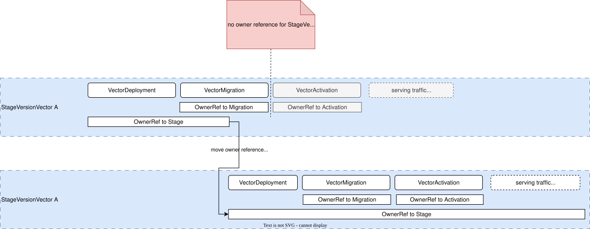
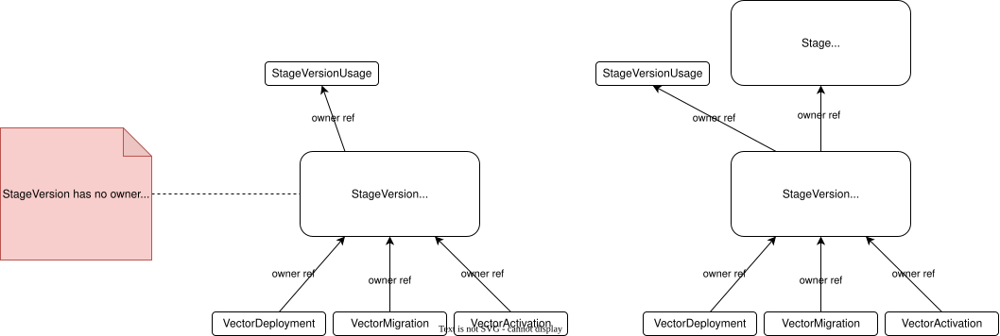
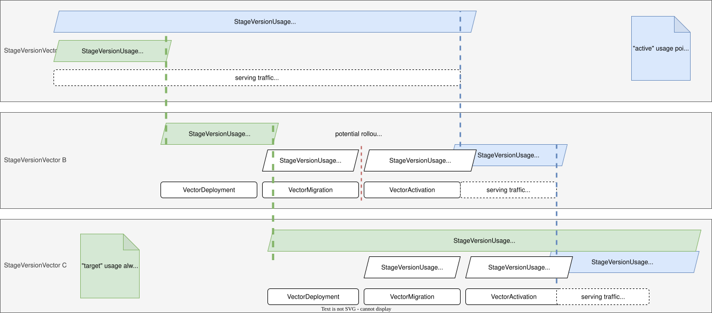
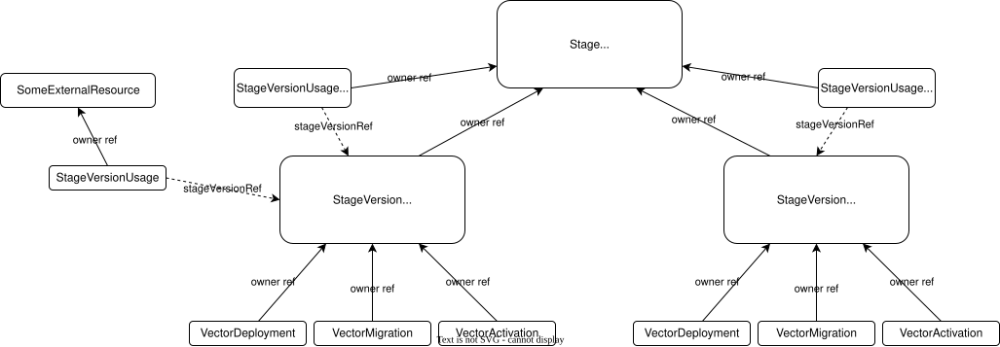

# ADR-0013: StageVersionUsage during vector rollout

<AdrHeader />

## Context

In [ADR 0009](./adr-0009-stage-version-crs.md) we introduced the `StageVersionUsage` CR to indicate that a specific `StageVersion` is still being used by something.
This is important to prevent deletion of a `StageVersion` as long as it is still in use.

Our initial approach was based on owner references to determine when a `StageVersion` could safely be undeployed:

* each `StageVersion` holds owner references to all `StageVersionUsage` CRs that are using it
* one `StageVersion` has an owner reference to the `Stage` resource itself, as long as this `StageVersion` represents the "latest" vector for the stage (i.e. `Stage` and `StageVersion` share the same `.spec.vector`).

However, this approach overlooked an important requirement: there must always be *at least one* `StageVersion` available and ready for use.
Without this safeguard, the “latest” `StageVersion` might be deleted while its successor is still in the process of rolling out, potentially causing unwanted service interruptions.



Another downside of the owner reference approach is that in some cases we completely drop the relationship between `Stage` and `StageVersion` resources.
That happens when a `StageVersion` is no longer the "latest" vector for a `Stage`, but is still in use by some `StageVersionUsage` resources.
In this case, the `StageVersion` would lose its owner reference to the `Stage`, which leads to orphaned resources if the `Stage` is deleted.
This behavior might or might not be desired, depending on the semantics of the `StageVersionUsage`.



## Considered Solutions
This ADR focuses on two different aspects of the `StageVersionUsage` resource:

* How to use it during the rollout of a vector to manage the lifecycle of a `StageVersion`
* How to keep track of the `StageVersionUsage`s for a given `StageVersion` and determine when a `StageVersion` can be deleted

### StageVersion lifecycle

The following diagram proposes a new approach on how `StageVersionUsage`s are created and deleted during a vector rollout.
Note that we no longer use owner references to control the lifecycle of a `StageVersion`.
Instead, the `StageVersionUsage` explicitly references the `StageVersion` it is using by the means described in [Relationship between StageVersion and StageVersionUsage](#relationship-between-stageversion-and-stageversionusage).



There are two new guiding principles:

1. one `StageVersionUsage` represents the "target" vector, i.e. the desired state of the `Stage`
2. one `StageVersionUsage` represents the "active" vector, i.e. the actual state of the `Stage`

#### `StageVersionUsage` with "target" vector
There is always one `StageVersionUsage` for the `StageVersion` with the "target" vector.
This represents the desired state of the `Stage` and makes sure the rollout of the desired vector is not interrupted.
Thus, for each `Stage`, there should be one `StageVersionUsage` that points to the last `StageVersion` that has been created.
This resource is managed by the stage controller.

#### `StageVersionUsage` with "active" vector
There is always one `StageVersionUsage` for the `StageVersion` that is "active" vector, which is currently serving traffic.
This represents the actual state of the `Stage` and makes sure that there is always at least one `StageVersion` available to serve traffic.
This resource is managed by the activation controller (or one of its tasks).

#### Accepted edge cases

1. It can happen that a vector is completely skipped and never becomes the "active" vector.
   If vector changes to a `Stage` happen in quick succession, the "target" vector might change before the previous "target" vector has become "active".
2. Vector rollouts can be interrupted when a new "target" vector is set.
   In the diagram above, this is indicated by the "potential rollout cancellation".
   Rollout steps which should not be interrupted (e.g. migrations) need to manage their own `StageVersionUsage`s.

#### Implementation details
It does not matter if we create new `StageVersionUsage` resources each time or reuse existing ones.
If we decide to create new ones, we need to be very careful about the ordering of creation and deletion to avoid accidental deletion of a `StageVersion`.

Both `StageVersionUsage`s should have an owner reference to the corresponding `Stage` resource.

### Special case: Deletion of a `Stage`/`StageVersion` resource
[ADR 0009](./adr-0009-stage-version-crs.md) did not discuss a special case: What happens when a `Stage` resource is deleted while there are still active `StageVersionUsage`s for its `StageVersion`s?
There are many possible approaches on how to handle this situation and the exact behavior will be discussed in a future ADR.

What is still noteworthy at this point, is that we should keep a proper owner hierarchy to ensure that all dependent resources are deleted when their owner is deleted.
We can define some general rules for this:

* Each resource which is a direct result (including transitive resources) of a `Stage` should be part of the ownership hierarchy tree starting from the `Stage`.
* The two special `StageVersionUsage`s for "target" and "active" vector should also have an owner reference to the `Stage`.
* `StageVersionUsage`s which are created by other components (e.g. migrations, user sessions, etc) should have an owner reference to the resource which semantically "owns" them.

By sticking to those rules, we can ensure that all resources belonging to a `Stage` are deleted when the `Stage` is deleted.
The following illustration visualizes the proposed ownership hierarchy.



### Relationship between StageVersion and StageVersionUsage
In general, owner references should not be used for managing the lifecycle of our custom resources, specifically not for `StageVersion` resources.
Instead, we extend the `spec` of the `StageVersionUsage`:

```yaml
apiVersion: landscape.konfidence.cloud/v1alpha1
kind: StageVersionUsage
spec:
  stageVersionRef: # exclusive with stageVersionSelector
    name: <name of the StageVersion>  # we don't need namespace, as StageVersionUsage is always in the same namespace as StageVersion
  stageVersionSelector: # exclusive with stageVersionRef
    matchLabels:
      konfidence.cloud/stage-name: dev
      konfidence.cloud/vector: common.konfidence.cloud/example/vector:0.0.1
```

Only one of the two fields `stageVersionRef` and `stageVersionSelector` may be set at a time.
Extending the `spec` with a dedicated fields makes the relationship explicit in the API.
It benefits from schema validation and documents the intent clearly.

We want to support both ways of referencing a `StageVersion`:

* `spec.stageVersionRef`: This is a direct reference to a specific `StageVersion` by name.
  It provides a convenient reference when we know exactly which `StageVersion` we want to use.
* `spec.stageVersionSelector`: This is a selector to reference a `StageVersion` by label.
  It provides flexibility when we want to reference a `StageVersion` based on its labels, e.g. the vector it represents.
  This is especially useful when the exact name of the `StageVersion` is not known when creating the usage.

## Decision

Considering all aspects, the CRD of the `StageVersionUsage` resource changes as follows:

```yaml
apiVersion: landscape.konfidence.cloud/v1alpha1
kind: StageVersionUsage
metadata:
  name: <tbd>
  namespace: <same as StageVersion>
  ownerReferences:
    - kind: <kind of the owner>
      name: <name of the owner> # points to the resource which semantically "owns" this StageVersionUsage, e.g. VectorMigration, UserSession, Stage (for rollout usage)
spec:
  reason: <reason for usage> # human-readable description of why this StageVersion is in use, e.g. "executing vector migrations", "latest vector for stage xyz", etc
  stageVersionRef:
    name: <name of the StageVersion>
  stageVersionSelector:
    matchLabels:
      konfidence.cloud/stage-name: dev
      konfidence.cloud/vector: common.konfidence.cloud/example/vector:0.0.1
status:
  conditions:
    # StageVersionUsage has to be reconciled by stage controller, so we can track if the referenced StageVersion actually exists
    # Those conditions only act as examples, implementation can differ
    - message: StageVersion is rolled out and ready for traffic
      reason: StageVersionReady
      status: "True"
      type: StageVersionReady
    - message: StageVersion not found
      reason: StageVersionNotFound
      status: "True"
      type: StageVersionNotFound # negative polarity type, only present if it is True.
```

The decision which `StageVersion`s are safe to delete is now based on the `spec.stageVersionRef` field of all existing `StageVersionUsage` resources.
Owner references are only used to ensure that dependent resources are deleted when their owner is deleted.
This also means, the owner reference from `StageVersion` to `Stage` remains in place to ensure proper cleanup of all stage-related resources when a `Stage` is deleted.

We need a new reconciliation loop in the stage controller for `StageVersionUsage` resources.
This reconciliation ensures that:

* the referenced `StageVersion` exists, otherwise it sets the `StageVersionNotFound` condition
* the referenced `StageVersion` is rolled out and ready for traffic, otherwise it sets the `StageVersionReady` condition to `False`

## Consequences

* **Fix shortcomings of the initial design:** The new approach ensures that there is always at least one `StageVersion` available at all times, preventing service interruptions during vector rollouts.
* **Clear API contract and intent:** By introducing `spec.stageVersionRef`, the relationship between a `StageVersionUsage` and its `StageVersion` becomes explicit.
  We also handle error conditions for `StageVersionUsage`s in a structured way using conditions, allowing developers to react to issues programmatically.
  Those changes improve readability of the API and reduce ambiguity for both developers and operators.
* **Correct Ownership hierarchy:** We now set up ownership references correctly to support cascading deletion of our custom resources as described in [Garbage Collection](https://kubernetes.io/docs/concepts/architecture/garbage-collection).
