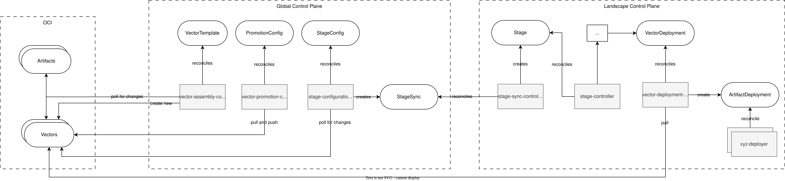
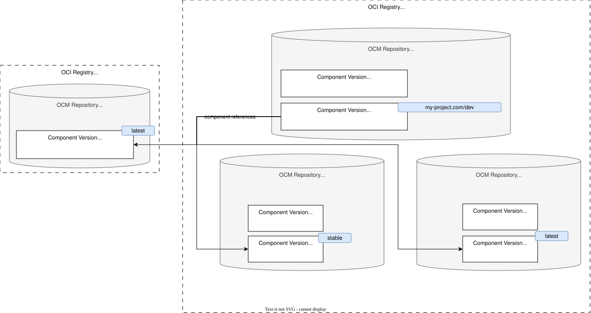
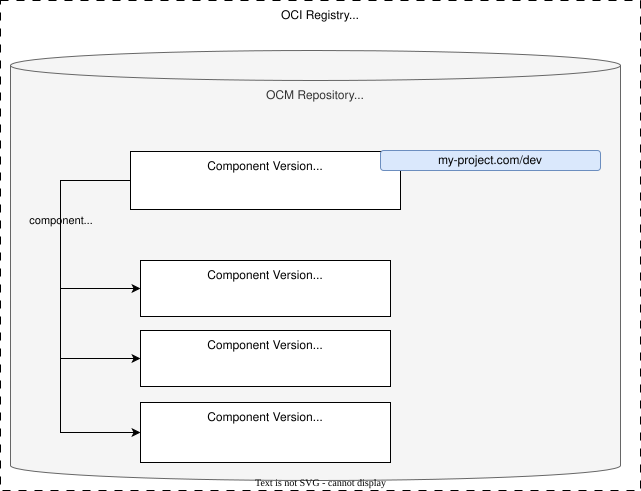

# ADR-0019: OCM in vector assembly

<AdrHeader />

## Context

In [ADR-6](./adr-0006-ocm-integration.md), we decided to use OCM as the underlying technology for representing artifacts and vectors in Konfidence. 
This means that all artifacts and vectors are OCM components, and we use OCM repositories to store and organize them.

This ADR focuses on how the controllers of the GCP will interact with OCM to enable assembly of new vectors and promotion of those vectors across different development stages.

For now, we assume that artifact components are created and pushed by using the OCM-provided CLI. 
This may change in future ADRs. 

## Overview

The following chart illustrates the interactions of our controllers with OCM components. 

{ style="width: 90%; display: block; margin: auto;" }

## OCM Repository Structure

Artifact OCM components will initially be pushed to distributed OCM repositories. 
This reflects the current ownership model, where teams manage separate OCM repositories with separate permissions so they cannot interfere with each other’s components. 
Teams usually should not have push access to the vector OCM repository, so that creation of new vectors is limited to Konfidence controllers.
An open question is whether we keep artifacts distributed or use OCM transport mechanisms to collect all artifacts into the vector OCM repository. 

Components are referenced only by their unique component name, while the actual storage location remains transparent and is resolved through configuration.
Depending on the decision, this may require passing OCM configuration (repository resolvers and credentials) from assembly to later vector deployment, which adds complexity and potential points of failure.


### Option 1 - Artifact components distributed in source repositories

When assembling a new vector, artifact components remain in their original OCM repositories. 
Because repository location is not part of the component reference, we must pass OCM configuration (repository resolver and credentials) from assembly to later vector deployment. 
If a repository is maintained by a development team, artifacts may be modified later (for example, deleted). 
We can detect such changes via digest validation, but this may block vector deployments.

{ style="width: 60%; display: block; margin: auto;" }


### Option 2 - Artifact components copied to central repository (preferred)

When assembling a new vector, artifact components are copied into the central vector OCM repository as part of the assembly process, using OCM tooling where possible. 
We must ensure that all vector dependencies are copied and available before the vector itself is pushed. 
In this model, the repository location for artifact components is always the same as the vector repository, so no additional repository resolution configuration is required for deployment. 
Because the OCM repository is controlled by Konfidence and teams do not have write permissions there, later modifications of components are unlikely.

{ style="width: 40%; display: block; margin: auto;" }

## Referencing OCM Components in CRDs

This section describes how components should be referenced in the OCM-related CRDs.  
The reference format affects portability, validation complexity, and whether additional OCM resolver configuration is required at runtime.

### Option 1: Structured component reference (preferred)

In this option, each component is referenced by a fully qualified structured reference, for example:  
`https://registry.example.com/example-app-tests//github.com/konfidence-project/bookinfo/productpage`.

This makes the component source explicit and self-contained in the CRD.  
As a result, reconciliation does not depend on external resolver mappings for locating repositories, which improves reproducibility and reduces operational ambiguity.  
This option is preferred because references are unambiguous and easier to validate.

### Option 2: Component names with external resolver configuration

In this option, components are referenced only by their logical component name, for example:  
`github.com/konfidence-project/bookinfo/productpage`.

Repository resolution is then performed via external OCM resolver configuration.  
This keeps manifests shorter, but introduces an implicit runtime dependency on configuration that must be consistently available across assembly and deployment workflows.

### Option 3: Allow both formats

In this option, both structured references and logical component names are allowed.  
This maximizes flexibility and can simplify migration from existing setups.  
However, it also increases API and reconciliation complexity, because validation, normalization, and error handling must support two input formats.

For implementation, if both formats are allowed, the controller should normalize all inputs into one canonical internal representation before further processing.

## Use of Version Aliases in assembly and promotions

OCM allows use of version aliases in OCI repositories: See [Version Aliasing in OCM specification](https://github.com/open-component-model/ocm-spec/blob/main/doc/04-extensions/03-storage-backends/oci.md#121-version-aliasing) for details.

We use this for two things:

1. to detect changes in artifacts
2. to assign a concrete vector version to a stage

### Artifact change detection
Artifacts in the `VectorTemplate` are referenced by component name and a version alias (e.g. `latest`, `stable`, `main`).
During reconciliation, we resolve the version alias to the concrete version/digest it is pointing to at the moment.
If that concrete version/digest differs from the last time we checked, this counts as change in the artifact.

We don't care if the version alias is pointing to a "newer" (more recent) version, we only check if it is different.
This allows for easy rollbacks by just moving the version alias back to the previous version, without having to push any change in code.

### Assigning vectors to stages
Similar to artifact change detection, version aliases are used to detect changes in vectors.
That means, for assigning a vector to a stage, we assign a specific version aliases to a stage.
This is done in the `StageConfiguration` resource.
During reconciliation of the `StageConfiguration`, we resolve the version alias for the vector, and assign the concrete version/digest to the `Stage` resource.

## Manual triggering of a promotion

For now, we only want to support manual triggering of promotions (automatic triggers may be added in the future).
We need to decide on a way to trigger a one-time execution of a promotion, without relying on changes in the `VectorPromotion` spec, because we want to be able to trigger promotions without changing the promotion configuration.

### Option 1: Dedicated `PromotionJob` resource (preferred)

We define a separate `PromotionJob` CRD that references a `VectorPromotion` to be executed. 
Creating a `PromotionJob` instance with the appropriate reference and parameters (e.g. TTL) will trigger a one-time execution of the promotion process. 
This approach provides a clear and explicit mechanism for manual promotions, and allows for tracking the status and history of promotion jobs.

### Option 2: Custom annotation on `VectorPromotion`

We can use a custom annotation on the `VectorPromotion` resource to trigger a promotion when the annotation is added or updated (similar to flux CLI: `flux reconcile <xyz>`). 
For example, adding an annotation like `konfidence.cloud/promote: "true"` could signal the controller to execute the promotion. 
While this approach avoids the need for an additional CRD, it can be less intuitive and may lead to confusion about the purpose of the annotation and how to use it correctly. 
It also makes it harder to track promotion attempts and their outcomes, since the trigger is not a first-class resource.

### Option 3: Sub-resource 

We expose a custom sub-resource (e.g. `VectorPromotion/promote`) that triggers a one-time execution of a promotion. 
The controller records the invocation and result in the `VectorPromotion` status. 
This approach keeps the trigger close to the primary resource and provides a clear, explicit API action without introducing an additional CRD.

However, recording execution history in the resource status does not scale well because status fields are intended to stay small and are not designed for unbound execution history. 
Additionally, executions cannot be observed or queried independently (e.g. kubectl get promotionjobs), making it difficult to list, label, or filter individual runs. 

## Examples CRDs

::: info
These are just examples to illustrate the concepts, they are not final and may change in the actual implementation.
:::
```yaml
kind: VectorTemplate
spec:
  # optional base vector, all components from base vector will be included in the constructed vector
  # this can point to a version alias or a concrete version
  base: https://my.registry.com/sample-project//my-project.com/base-vector:latest
  
  # the destination for the newly assembled vector, this is where the vector will be pushed to
  # this MUST point to a version alias, the actual version string will be composed based on the vector content
  uploadTarget: https://my.registry.com/sample-project//my-project.com/constructed-vector:latest
  
  # list of components to be included in the vector, these are referenced by their structured component name and version (or version alias)
  # all resolved component versions are copied to the [spec.uploadTarget] repository as part of the assembly process
  components:
    - name: https://my.registry.com/sample-project//my-project.com/team-a/service1:stable
    - name: https://my.registry.com/sample-project//my-project.com/team-b/service2:experimental
    - name: https://ghcr.io/external-project//external-project.com/external-service:v1.0.0
```

```yaml
kind: VectorPromotionConfig
spec:
  # the source vector to be promoted, this vector will be pulled and pushed to the target location
  # this can point to a concrete version, but usually it will point to a version alias
  source: https://my.registry.com/sample-project//my-project.com/constructed-vector:latest

  # the target where the promoted vector will be pushed to
  # this MUST point to a version alias, the actual version string is taken from the source vector
  target: https://my.registry.com/sample-project//my-project.com/constructed-vector:promoted
---
kind: VectorPromotionConfig
spec:
  source: https://my.registry.com/sample-project//my-project.com/constructed-vector:latest
  target: https://other.registry.com/promoted-vectors//my-project.com/constructed-vector:latest

  # (optional) trigger specifies conditions under which promotions can happen automatically 
  # empty trigger means it can only be triggered by PromotionJob
#  trigger:
#    - type: cron
#      expression: "9 0 * * *" # every morning at 9am
#    - type: event 
status:
  lastPromotionTime: 2024-01-01T00:00:00Z
---
kind: VectorPromotion
spec:
  # the promotion to be triggered
  promotionConfigRef: my-promotion
  ttl: 1h # how long the promotion job should be kept after completion
status:
  state: pending|running|completed|failed
```

```yaml
kind: StageConfiguration
spec:
  # name of the stage to be created/updated
  name: stage-dev
  
  # the vector to be deployed to the stage, this vector will be pulled and applied to a corresponding stage resource
  # this can point to a concrete version, but usually it will point to a version alias
  vector: https://my.registry.com/sample-project//my-project.com/constructed-vector:latest
  
  # interval for checking changes in the vector and re-deploying the stage
  interval: 1m
  
  # target where the stage will be created at
  targetWorkspace: root:project-lcp
  targetNamespace: dev-eu
---
kind: Stage
metadata:
  name: stage-dev
  namespace: dev-eu
spec:
  # the vector to be deployed to the stage, this vector will be pulled and deployed to the target location
  vector: https://my.registry.com/sample-project//my-project.com/constructed-vector:v1.0.0
  digest: sha256:1234567890abcdef
```


## `VectorTemplate` Reconciliation

Reconciliation for `VectorTemplate` looks roughly like this:

1. resolve all artifact version aliases to concrete versions
2. resolve vector version alias and pull the concrete component descriptor behind it
3. compare content of vector to the discovered artifact versions
4. if there are any changes
    1. assemble a new component descriptor for the vector
    2. copy all artifacts to the vector repository
    3. push the new vector to the vector repository
    4. move the version alias of the vector component to that newly pushed vector

## Decision
* Artifact components copied to central repository
* Reference components by structured component reference (full URL)

## Open Questions

### 1. How to reference configuration / credentials?

In the planned setup of the GCP, the controllers will reconcile CRs from multiple tenants. 
Each tenant can have different OCM repository configurations and credentials, depending on where their artifacts and vectors are stored.
This means that we need to provide a way for the controllers to access the correct OCM configuration for each tenant during reconciliation.
Because of tenant isolation, we cannot rely on a shared controller configuration, so we likely need to pass the configuration as part of the CRs.

```yaml
kind: VectorTemplate
spec:
  # ...

  configRefs:
    - name: my-registry-credentials
      type: Secret
    - name: some-ocm-configuration
      type: ConfigMap
```

### 2. Are vector component names allowed to be changed during promotion?

In the current OCM specification, component names are immutable and must be unique within a repository.
We do not have any restrictions on how the component name of a vector looks like, but we need to consider whether we want to allow changing the component name during promotion.

### 3. Which promotion trigger types do we want to support?

For now we stick to manual promotion with creating a `PromotionJob`, but in the future we may want to support automatic promotions based on certain triggers, for example:
- time-based triggers (e.g. cron schedule)
- event-based triggers (e.g. when a new vector version is available, when a certain stage is successfully deployed, etc.)
- quality gate triggers (e.g. when a vector passes certain tests or checks)
- other custom triggers