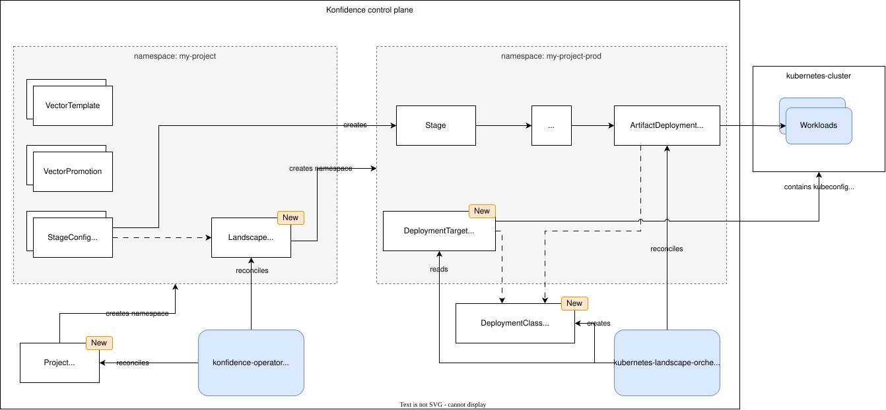

# ADR-0027: Landscape and deployment target concept

<AdrHeader />

## Context

Konfidence needs infrastructure-agnostic definitions for organizing deployments across different landscapes and target platforms. 
The core concepts must work across any target platform where software artifacts can deployed as part of an application (e.g. Kubernetes clusters, CloudFoundry spaces, FaaS providers, CDN services, etc). 
The goal is that a developer can group all runtimes that belong to the same logical target (landscape) and see which vectors and stages exist within this group.

Two fundamental concepts have emerged but lack formal definition:

1. **Resource grouping** by the user or by infrastructure requirements (security, access control, resource limits, compliance)
2. **Deployment Destinations** where software artifacts are moved to, to serve a purpose in running applications

This ADR proposes formal definitions for these concepts and their relationships to existing Konfidence resources.

## Definitions

### Deployment Class and Target

A **deployment class** is a reference, which describes the capability to deploy software artifacts to a target platform, service or infrastructure, so that the artifact can fulfill a role in an application.
Artifacts reference a deployment class in their manifest.
By that, the artifact selects which exact deployer implementation is responsible for deploying it.
The type can also be used to validate if a landscape supports all required deployment targets for a given vector.

Deployment classes use vendor-specific domain prefixes following the pattern `<vendor-domain>/<type>` (e.g. `konfidence.cloud/helm`).
The vendor domain identifies the deployer implementation that handles artifacts of this type.
This approach accepts that artifacts have a deployment-time dependency on a specific deployer, which is responsible for interpreting and deploying them.
Using vendor-specific prefixes provides clear ownership and allows deployer vendors to introduce new deployment types within their namespace without coordination overhead.

A **deployment target** is a configured destination for a deployment class (e.g. a concrete kubernetes cluster) defined by its connection details and configuration.
With that, the orchestrator knows how to connect to the target and deploy artifacts.
Deployment targets also include deployment variables - configuration values that are shared across all deployments to this target (e.g., resource limits, ingress domains, cloud provider-specific settings).
For now, each landscape can only have one deployment target for a given deployment class type, but multiple landscapes can have different targets of the same type.
This restriction can be lifted in the future if needed.

Examples for deployment classes:

- **Execution platforms**: Kubernetes clusters, CloudFoundry spaces, AWS Lambda, Azure Functions, Google Cloud Run
- **Content delivery networks**: Cloudflare, Akamai, CloudFront
- **Object storage**: S3 buckets, Azure Blob Storage, GCS buckets
- **Self-managed infrastructure**: Virtual machines, bare metal servers

Note: Multiple deployment classes (e.g. `konfidence.cloud/helm` and `konfidence.cloud/kustomize`) can share the same underlying deployment target (e.g. a Kubernetes cluster accessed via the same kubeconfig).

### Landscape

A **landscape** is a logical group of deployment targets and control plane resources that share common organizational, operational and security requirements.
A landscape hosts one or more stages which share underlying deployment targets and configuration.

Landscapes are defined by shared **infrastructure requirements**:

- **Access control and ownership**: Who can deploy, manage or access resources
- **Security posture**: Authentication requirements, network isolation, encryption policies
- **Resource constraints**: CPU, memory, cost budgets, quota limits
- **Compliance requirements**: Regulatory constraints, data residency
- **Operational characteristics**: SLAs, availability requirements, support level

Organizations define their own landscape boundaries based on their requirements. Common patterns include:

- **Environment-based**: `landscape-dev`, `landscape-test`, `landscape-prod`
- **Region-based**: `landscape-eu`, `landscape-us`, `landscape-cn`
- **Mix of the above**: `landscape-prod-eu`, `landscape-prod-us`

## Conceptual View

{ style="width: 80%; display: block; margin: auto;" }

The high-level flow for the user is as follows:

1. create a cluster-scoped `Project` CR → creates a project namespace
2. create a `Landscape` CR in the project namespace → creates a landscape namespace
3. install a deployer which creates a cluster-scoped `DeploymentClass` CR → declares available deployment class types
4. create a `DeploymentTarget` CR in the landscape namespace → defines a deployment target for this landscape
5. create a `Stage` CR in the landscape namespace → corresponding artifacts will be deployed to the deployment target

## Implementation Design

To realize these concepts in Konfidence, we introduce new CRDs and define their relationships with existing resources.

### Project Creation and Representation

#### Project CRD

A new `Project` CRD will be introduced as a **cluster-scoped** resource that creates and manages project namespaces.
`Project` CRs are created manually in the Konfidence cluster and reconciliation will create a corresponding project namespace with standard labels, annotations, etc.

**Example**:
```yaml
apiVersion: konfidence.cloud/v1alpha1
kind: Project
metadata:
  name: my-project
```

_Note: 
For now, the `Project` CRD is purely defined by its name and does not contain any additional spec fields. 
This will be extended in the future to include fields for authorization policies and other project-level configurations._


### Landscape Creation and Representation

#### Landscape CRD

A new `Landscape` CRD will be introduced as **namespace-scoped** resource that creates and manages landscape namespaces.
`Landscape` CRs are created manually in a project namespace and reconciliation will create a corresponding landscape namespace with standard labels, annotations, owner refs, etc.

**Example**:
```yaml
apiVersion: konfidence.cloud/v1alpha1
kind: Landscape
metadata:
  name: production
spec:
  deploymentVariables:
    landscapeName: production
status:
  namespace: landscape-production  # name of the namespace created for this landscape
  deploymentTargets: 
      # list of deployment targets available in this landscape, schema to be refined during implementation
    - class: konfidence.cloud/helm
      status: Configured
    - class: konfidence.cloud/kustomize
      status: NotConfigured
  conditions:
    - type: Ready # set when the namespace is ready
      status: "True"
```

### Deployment Class Discovery

#### DeploymentClass CRD

Each deployer (e.g. kubernetes-landscape-orchestrator) installs cluster-scoped `DeploymentClass` resources that declare its capabilities.
The deployer's controllers run on Konfidence control-plane level (*not* per-landscape).

A single deployer can provide multiple deployment classes. For example, the kubernetes-landscape-orchestrator provides both `helm` and `kustomize` deployment classes.

**Example**:
```yaml
# kubernetes-landscape-orchestrator provides Helm deployment capability
apiVersion: konfidence.cloud/v1alpha1
kind: DeploymentClass
metadata:
  name: kubernetes-helm
spec:
  type: konfidence.cloud/helm
  controller: kubernetes-landscape-orchestrator
  version: v1.2.3
---
# Same deployer also provides Kustomize deployment capability
apiVersion: konfidence.cloud/v1alpha1
kind: DeploymentClass
metadata:
  name: kubernetes-kustomize
spec:
  type: konfidence.cloud/kustomize
  controller: kubernetes-landscape-orchestrator
  version: v1.2.3
---
# Different deployer for CloudFoundry
apiVersion: konfidence.cloud/v1alpha1
kind: DeploymentClass
metadata:
  name: cloudfoundry-app
spec:
  type: konfidence.cloud/cloudfoundry
  controller: cloudfoundry-landscape-orchestrator
  version: v2.0.1
```

#### DeploymentTarget CRD

Each landscape can have one namespace-scoped `DeploymentTarget` for each `DeploymentClass`.
The `DeploymentTarget` contains the connection details and configuration for a specific deployment target.

For Kubernetes-based deployment classes (`helm`, `kustomize`, `raw-manifests`), multiple deployment classes can share the same underlying Kubernetes cluster by referencing the same kubeconfig secret.
This allows deployers to use different deployment mechanisms (Helm vs Kustomize) while targeting the same cluster.

Deployment variables are configuration values that are injected into or required for deployments to this target. 
They are shared across all deployments to this deployment target (e.g., resource limits, ingress domains, cloud provider-specific settings).


**Kubernetes Examples (Helm and Kustomize sharing the same cluster):**
```yaml
# Helm deployment target for production Kubernetes cluster
apiVersion: konfidence.cloud/v1alpha1
kind: DeploymentTarget
metadata:
  name: kubernetes-helm-production
  namespace: landscape-production
spec:
  type: konfidence.cloud/helm  # References the helm DeploymentClass
  
  connection:
    type: kubeconfig  # hint for how the parse the ref
    ref:
      kind: Secret
      name: prod-cluster-kubeconfig  # Shared kubeconfig for the cluster
  
  deploymentVariables:
    defaultNamespace: "production-apps"
    helmTimeout: "10m"
    ingressDomain: "prod.example.com"
---
# Kustomize deployment target for the SAME production Kubernetes cluster
apiVersion: konfidence.cloud/v1alpha1
kind: DeploymentTarget
metadata:
  name: kubernetes-kustomize-production
  namespace: landscape-production
spec:
  type: konfidence.cloud/kustomize  # References the kustomize DeploymentClass
  
  connection:
    type: kubeconfig
    ref:
      kind: Secret
      name: prod-cluster-kubeconfig  # Same kubeconfig as Helm target
  
  deploymentVariables:
    defaultNamespace: "production-apps"
    enablePrune: "true"
    ingressDomain: "prod.example.com"
---
# The shared kubeconfig secret for the Kubernetes cluster
apiVersion: v1
kind: Secret
metadata:
  name: prod-cluster-kubeconfig
  namespace: landscape-production
stringData:
  kubeconfig: |
    apiVersion: v1
    kind: Config
    clusters: [...]
```

**CloudFoundry Example:**
```yaml
# CloudFoundry deployment target
apiVersion: konfidence.cloud/v1alpha1
kind: DeploymentTarget
metadata:
  name: cloudfoundry-production
  namespace: landscape-production
spec:
  type: konfidence.cloud/cloudfoundry
  
  connection:
    type: credentials
    ref:
      kind: Secret
      name: cf-prod-credentials
  
  deploymentVariables:
    defaultMemory: "512M"
    defaultInstances: "2"
    domain: "apps.prod.example.com"
---
apiVersion: v1
kind: Secret
metadata:
  name: cf-prod-credentials
  namespace: landscape-production
stringData:
  apiEndpoint: "https://api.cf.prod.example.com"
  username: "deployer@example.com"
  password: "secure-password"
  org: "production-org"
  space: "production-space"
```

**AWS Lambda Example:**
```yaml
# AWS Lambda deployment target
apiVersion: konfidence.cloud/v1alpha1
kind: DeploymentTarget
metadata:
  name: lambda-us-east-1
  namespace: landscape-production
spec:
  type: konfidence.cloud/lambda
  
  connection:
    type: aws-credentials
    ref:
      kind: Secret
      name: aws-lambda-credentials
  
  deploymentVariables:
    region: "us-east-1"
    defaultTimeout: "30"
    defaultMemory: "1024"
    roleArn: "arn:aws:iam::123456789012:role/lambda-execution-role"
---
apiVersion: v1
kind: Secret
metadata:
  name: aws-lambda-credentials
  namespace: landscape-production
stringData:
  accessKeyId: "ACCESS_KEY_ID_EXAMPLE"
  secretAccessKey: "SECRET_ACCESS_KEY_EXAMPLE"
```
