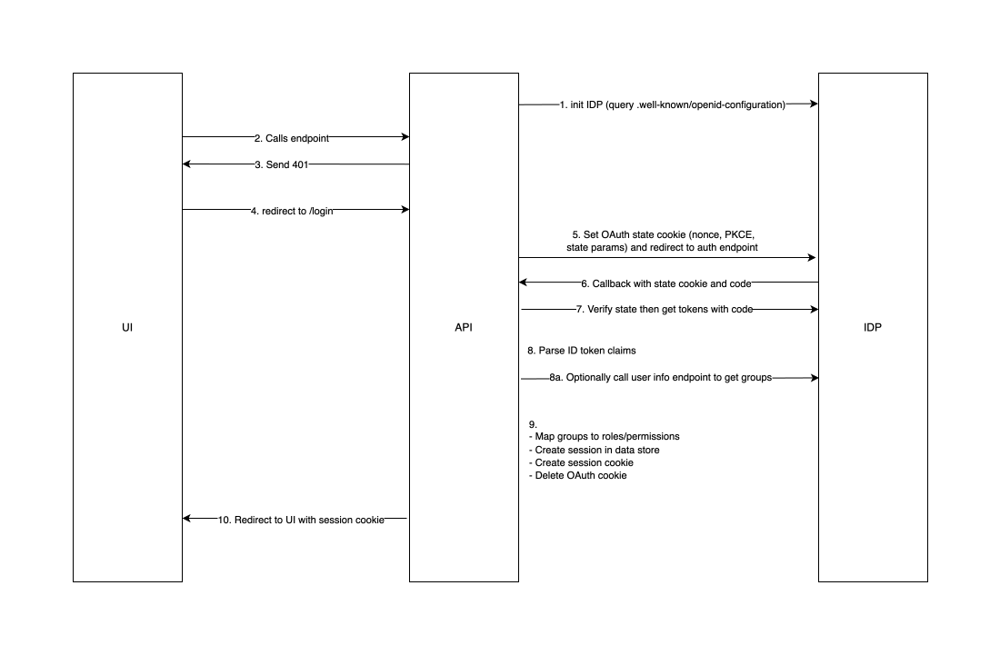
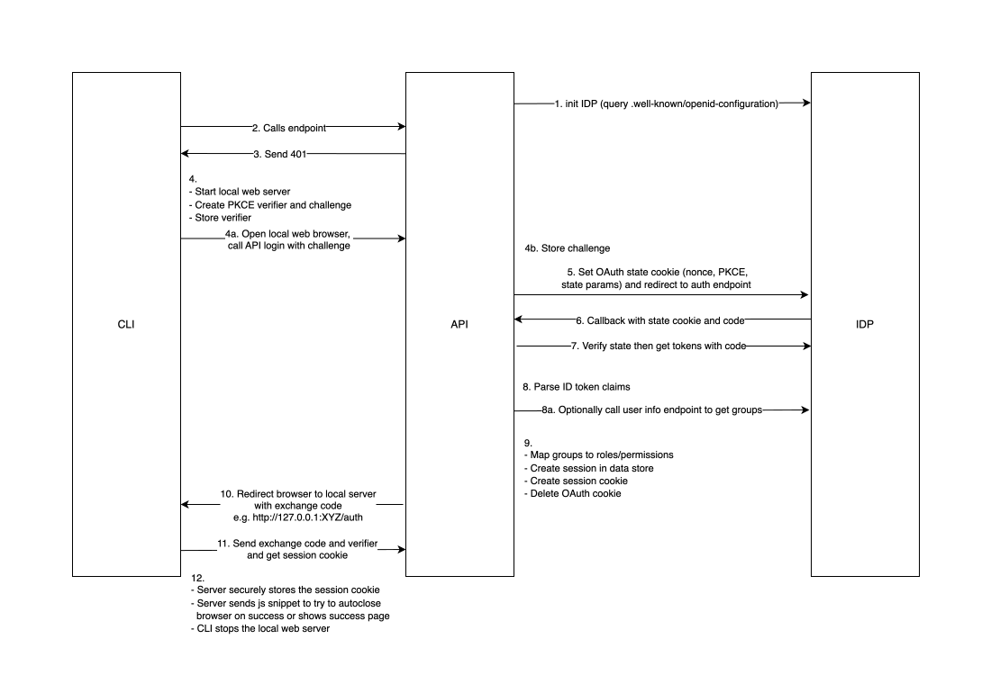
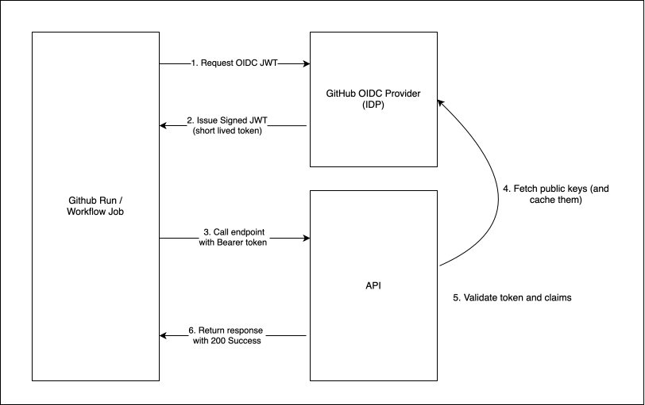

# ADR-0030: API authentication flows

<AdrHeader />

## Context

The Konfidence API service needs to authenticate clients that interact with it.
Typical clients are user interfaces (UI), command-line applications (CLI) 
and workloads, like a CI pipeline. Three different authentication flows 
for each of the client types will be described in this ADR.

## Decision

OpenID Connect (OIDC) authentication flows with an external identity provider (IDP) will
be used for all clients. No OIDC tokens will be exposed to the clients. The API service
creates a session instead and only sends a session cookie with the session id back to the clients.
The session must timeout after a configurable interval (unless the client interacts
with the API) and should be stored in a database. All API endpoints (except for login
and Identity Provider callback) must be secured by session validation. 
The client must be able to invalidate (logout) a session and to get the user identity without security related data (e.g. claims, groups, etc.). 

The API service also maps user groups from the ID token to predefined roles (e.g. dev, admin etc.)
based on project scoped configuration resources to enable user authorization. Details regarding the
authorization flow can be found [here](./adr-0028-project-crd-multi-tenancy.md#authorization-flow).

### UI Authentication Flow

{ style="width: 80%; display: block; margin: auto;" }

The UI authentication flow works as follows:

1. API service gets essential IDP metadata (e.g. authorization, token, and user info endpoints)
   from the OIDC discovery endpoint
2. UI tries to call an API endpoint with no session cookie
3. API returns 401 response
4. UI redirects to API login endpoint
5. API sets OAuth state cookie and redirects to IDP authentication endpoint
6. IDP sends state cookie and authorization code to API callback
7. API verifies the state cookie and uses the authorization code to get ID and Access token
8. API parses the token claims. Optionally (8a.) get user groups from user information IDP endpoint
9. API maps user groups to roles based on Project configuration. It creates a session, stores it in
   the datastore, creates a session cookie that contains the session id and deletes the OAuth state cookie.
10. API redirects to UI with session cookie set. UI can now use the session cookie to send requests to the API
 

### CLI Authentication Flow

{ style="width: 80%; display: block; margin: auto;" }

The CLI authentication flow works as follows:

1. API service gets essential IDP metadata (e.g. authorization, token, and user info endpoints)
   from the OIDC discovery endpoint
2. CLI tries to call an API endpoint with no session cookie
3. API returns 401 response
4. CLI creates PKCE verifier and challenge and stores the verifier. The CLI then starts a local web server and (4a.) opens a local web browser to call the API login endpoint with the PKCE challenge code.
   (4.b) API stores the challenge code
5. API sets OAuth state cookie and redirects to IDP authentication endpoint
6. IDP sends state cookie and authorization code to API callback
7. API verifies the state cookie and uses the authorization code to get ID and Access token
8. API parses the token claims. Optionally (8a.) get user groups from user information IDP endpoint
9. API maps user groups to roles based on Project configuration. It creates a session, stores it in
   the datastore, creates a session cookie that contains the session id and deletes the OAuth state cookie.
10. API redirects browser to the local web server with a temporary exchange code
11. The local web server extracts the exchange code and sends it with the original PKCE verifier to the API to get the session cookie. The server securely stores the session cookie from the request (e.g. key chain) and tries to autoclose the browser 
    window using a javascript snippet or (if this does not work) shows a success page after successful authentication.
    CLI then stops the local web server and can now use the session cookie to send requests to the API.

### CI Pipeline Authentication Flow

{ style="width: 80%; display: block; margin: auto;" }

For GitHub the CI authentication flow works as follows:

1. Pipeline requests a short-lived OIDC token (JWT) from the GitHub IDP
2. GitHub IDP issues a signed token
3. Pipeline sends the token as Bearer token to the API endpoint
4. API fetches (if necessary) the public key set (JWKS) from the IDP and caches it
5. API validates the token and checks that the token contains the correct claims for the current request.
6. If token and claims are valid the API sends the response with HTTP code 200


### Configuration

The API is only supporting a single IDP for all projects in the k8s cluster. All given configurations are applied to all projects.

The configuration is done in the helm chart and can be configured via helm value.

**Example**
```yaml
api:
  issuer-url: https://someidp/oauth
  refresh-session: false
  session-timeout: 18000
```


