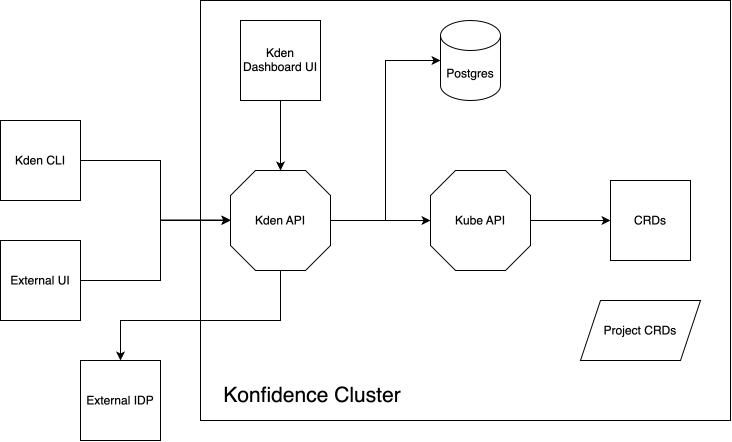

# ADR-0031: API principles

<AdrHeader />

## Context

Konfidence establish an Konfidence HTTP API to provide a unified behavior of Konfidence across all potential clients (CLI, UI, external UI's, etc.). 
The Konfidence API will handle all kind of topics within Konfidence like control of delivery flow, gathering runtime data, troubleshoot deployment issues, etc..
The Konfidence API is also covering a single point of entry to gain permission control.

This ADR, along with [ADR-0029](./adr-0029-api-gateway.md), defines the principles, conventions and design of the API service.

## Decision

### Architectural Overview

{ style="width: 80%; display: block; margin: auto;" }

### Protocol
Use of **HTTP** protocol which aligns well with the stack of Konfidence (kden-cli, kden UI, decisions regarding API server).
Konfidence should optionally support SSL.

### Versioning
Established during the framework decision in [ADR-0029](./adr-0029-api-gateway.md). Konfidence uses path-based versioning, meaning all domain routes are versioned e.g. `/api/v1/`.
Versioning strategy is out of scope of this ADR and will be, if necessary, defined in a future ADR.

### RESTful services
Konfidence API will be designed as a RESTful service. If necessary resources will be cached.
Konfidence uses the API-spec-first approach, meaning a openapi spec is used as API contract for all clients. Further details [ADR-0029](./adr-0029-api-gateway.md)

### Authentication/Authorization
The Authentication principles and flows are described in [ADR-0030](./adr-0030-api-auth-flows.md).
The Authorization mapping is described in [ADR-0028](./adr-0028-project-crd-multi-tenancy.md#authorization-flow)

### Installation routine
The Konfidence API will be part of Konfidence core installation routine (konfidence HELM chart). 
The Konfidence core HELM chart will contain all required components of the API with a minimal set of pre-configurations.

## Related ADRs

- [ADR-0028](./adr-0028-project-crd-multi-tenancy.md) - Konfidence Authorization
- [ADR-0029](./adr-0029-api-gateway.md) - API framework and structure
- [ADR-0030](./adr-0030-api-auth-flows.md) - Konfidence API Authentication Flows
