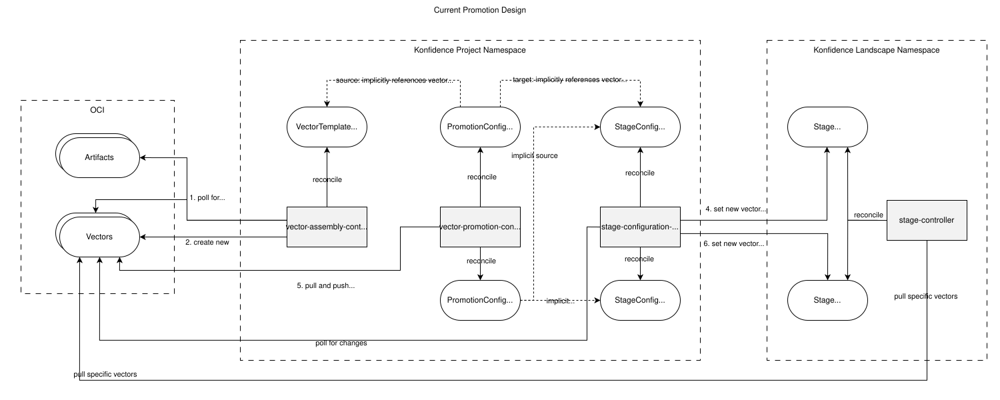
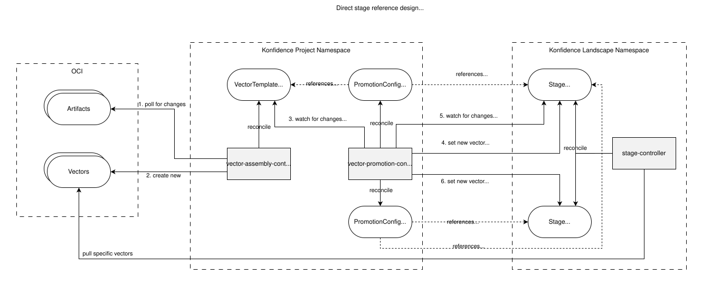
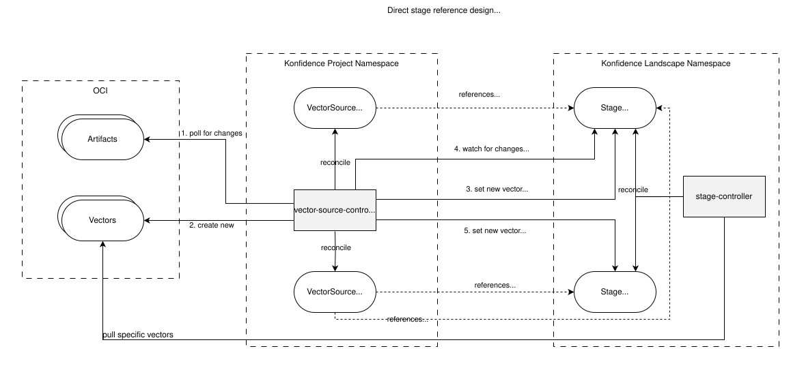
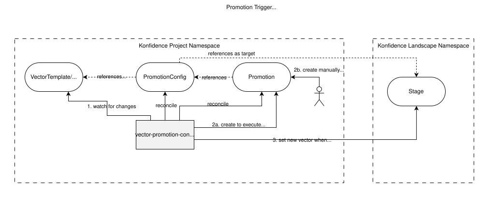
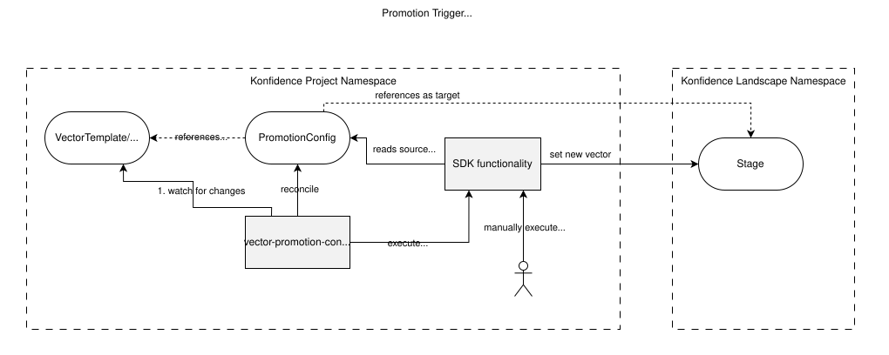
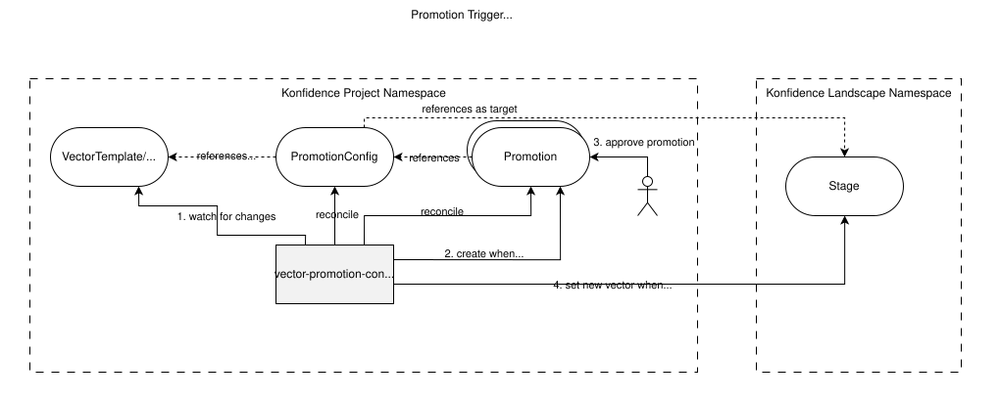

# ADR-0032: Vector promotions

<AdrHeader />

## Context

[ADR-0019](./adr-0019-ocm-vector-assembly.md) describes the current design for vector assembly, stage resolution, and promotion:



- A `VectorTemplate` assembles a vector and pushes it to the OCI registry under a named alias tag (e.g. `:latest`).
- A `StageConfiguration` polls the OCI registry for changes on a configured alias tag and updates the corresponding `Stage` object with the resolved concrete vector version.
- A promotion between two stages is performed implicitly by moving the alias tag that the target `StageConfiguration` watches to point to a different concrete version.

This design has led to several problems in practice:

- **Propagation delay:** Changes (such as a completed promotion) take time to propagate through the system because `StageConfiguration` relies on polling. This makes it difficult for users to understand the system's current state.
- **Drift detection overhead:** To detect drift between source and target tags, both tags need to be resolved and compared in a regular interval, adding further delay. The entire vector needs to be downloaded to compute a per-component diff.
- **Visualization complexity:** Vector alias tags do not map one-to-one to stages. A single promotion can affect multiple stages or none at all, requiring a complex UI that also represents the alias tags themselves.
- **Combinatorial complexity:** The objects can be composed in non-obvious ways. For example, multiple promotions can be chained without ever deploying to a stage. While this provides flexibility, it makes the system harder to understand and visualize.


## Direct stage reference design

This ADR proposes eliminating alias tags from the promotion model. Instead, concrete vector versions are written to the `Stage` object directly, making the `StageConfiguration` resource obsolete. A promotion then references stages directly and copies a concrete vector version into the target stage rather than updating an alias tag in the OCI registry.

Credential handling and vector verification remain at assembly, unchanged from the current design (see ADR-0019). A promotion does not carry credentials or verification configuration: it re-points the target stage at an existing component version and never rebuilds or transfers OCM content, so there is nothing to verify and no registry access to authenticate at promotion time.

### Option 1: Separate VectorTemplate and VectorPromotionConfig resources



The `VectorTemplate` resource continues to define how a vector is assembled from individual component versions. However, the `uploadTarget` field no longer includes an alias tag. The `VectorTemplate` still pushes a vector with a concrete version to the OCI registry, but no longer moves a generic alias (like `:dev`) to that new version.
It remains possible to base an assembled vector on another existing vector by referencing another `VectorTemplate` as base.

```yaml
apiVersion: konfidence.cloud/v1alpha1
kind: VectorTemplate
metadata:
  name: dev-vector
spec:
  base:
    kind: VectorTemplate
    name: base-vector
  uploadTarget: https://.../my-vector
  components:
    - name: https://.../service-a:latest
    - name: https://.../service-b:latest
    - name: https://.../service-c:latest
status:
  latestVector: https://.../my-vector:2026.7.27-143052000Z
```

After assembling a new vector, the `VectorTemplate` controller writes the concrete version reference to `status.latestVector`. This replaces the role previously held by the alias tag in the OCI registry.

To deploy the assembled vector to a stage, a `VectorPromotionConfig` is defined. It references the `VectorTemplate` as the source and a `Stage` as the target. Executing the promotion reads the concrete vector version from the source's `status.latestVector` and writes it to the target stage. Changes to the `VectorTemplate` status are detected immediately instead of relying on polling once again.

Because stages live in landscape-managed namespaces while the `VectorPromotionConfig` lives in the project namespace (see ADR-0027), stage references carry the `Landscape` name instead of a namespace: the controller resolves the `Landscape` object in the config's own namespace to its managed namespace. This keeps references human-readable and makes cross-project references impossible by construction. `landscape` is required for `Stage` references and omitted for `VectorTemplate` references, which resolve in the config's namespace.

```yaml
apiVersion: konfidence.cloud/v1alpha1
kind: VectorPromotionConfig
metadata:
  name: latest-to-dev
spec:
  source:
    kind: VectorTemplate
    name: dev-vector
  target:
    kind: Stage
    name: dev-stage
    landscape: dev
```

A promotion from one stage to another looks similar, with the source being a `Stage` instead of a `VectorTemplate`:

```yaml
apiVersion: konfidence.cloud/v1alpha1
kind: VectorPromotionConfig
metadata:
  name: dev-to-test
spec:
  source:
    kind: Stage
    name: dev-stage
    landscape: dev
  target:
    kind: Stage
    name: test-stage
    landscape: test
```

The config reconciler owns a `Ready` condition on the `VectorPromotionConfig` that eagerly reports unresolvable landscapes, stages, or sources — a config pointing at a missing resource says so at declaration time and recovers as soon as the resource appears. The referenced resources are never created by the promotion machinery.

### Option 2: Combined VectorSource resource



Instead of separate resources for vector assembly and promotion, both concerns could be merged into a single `VectorSource` resource (name tbd). This object specifies components, an upload target, and a target stage. When drift is detected in the components, a new vector is built, pushed to the OCI registry, and immediately assigned to the target stage.

```yaml
apiVersion: konfidence.cloud/v1alpha1
kind: VectorSource
metadata:
  name: latest-to-dev
spec:
  components:
    - name: https://.../service-a:latest
    - name: https://.../service-b:latest
    - name: https://.../service-c:latest
  uploadTarget: https://.../my-vector
  targetStage: stage-dev
```

The `VectorSource` object can also be used to promote from one stage to another:

```yaml
apiVersion: konfidence.cloud/v1alpha1
kind: VectorSource
metadata:
  name: dev-to-test
spec:
  sourceStage: stage-dev
  targetStage: stage-test
```

Compared to Option 1, this has the following advantages:

- Less configuration effort when setting up a promotion flow
- Ability to modify the vector during promotion by combining the `components` field with a `sourceStage`

However, there are disadvantages:

- Two distinct concepts (assembly and promotion) are conflated, which could impose architectural constraints later (e.g. if one concern needs to evolve independently). The difficulty of naming this combined resource is symptomatic of the mismatch.
- There is no longer an option to base one `VectorTemplate` on another.
- If the same vector should be deployed to multiple stages, the entire components list must be duplicated. With Option 1, a single `VectorTemplate` can be referenced by multiple `VectorPromotionConfig` objects.


## VectorPromotion Trigger

Regardless of which resource design is chosen above, the question remains how a promotion is actually triggered. The following section assumes Option 1 (separate `VectorPromotionConfig`) for illustration, but the trigger mechanism applies equally to Option 2.

### Option A: One-shot VectorPromotion resource



The approach mirrors the current `VectorPromotion` / `VectorPromotionConfig` pattern. The `VectorPromotionConfig` controller continuously monitors its source and target for drift and reflects the result in its status:

```yaml
apiVersion: konfidence.cloud/v1alpha1
kind: VectorPromotionConfig
metadata:
  name: dev-to-test
spec:
  source:
    kind: Stage
    name: dev-stage
  target:
    kind: Stage
    name: test-stage
status:
  sourceVector: https://.../my-vector:2026.7.27-143052000Z
  targetVector: https://.../my-vector:2026.7.25-091200000Z
  drift: true
```

To execute the promotion, a user (or an automated process) creates a `VectorPromotion` object referencing the configuration:

```yaml
apiVersion: konfidence.cloud/v1alpha1
kind: VectorPromotion
metadata:
  name: dev-to-test-20260727
spec:
  vectorPromotionConfigRef: dev-to-test
  ttlAfterFinished: 24h
status:
  state: Succeeded
  promotedVector: https://.../my-vector:2026.7.27-143052000Z
```

The `VectorPromotion` controller reads the current source vector from the `VectorPromotionConfig` status, writes it to the target stage, and reports the result. After a successful promotion, the controller must also immediately update the `VectorPromotionConfig` status to reflect that drift no longer exists. Without this, the UI would continue showing a stale drift state until the next scheduled reconcile of the `VectorPromotionConfig`. The `VectorPromotion` object is deleted after its TTL expires.

When the source kind is `VectorTemplate`, the `VectorPromotionConfig` controller always creates a `VectorPromotion` object automatically whenever drift is detected. This preserves the current behavior where new artifact versions flow to the first stage without manual intervention.

Advantages:

- Mirrors the existing `VectorPromotion` pattern, so the migration path is straightforward
- Each `VectorPromotion` object serves as an audit record of an individual execution

Disadvantages:

- Race condition: the source version can change between the user's decision to promote and the moment the `VectorPromotion` is executed, potentially promoting an unintended version

### Option B: SDK-driven promotion



In this approach, the promotion is not triggered by applying a Kubernetes resource. Instead, the core logic — reading the source vector version and writing it to the target `Stage` — is implemented as a shared function in the `pkg` package (referred to as "SDK" here). This package is shared by all controllers and published for third-party use. The function is called from two places:

1. The Konfidence API endpoint for manually triggering a promotion
2. The `VectorPromotionConfig` controller for auto-promotion when the source kind is `VectorTemplate` (or the `VectorTemplate` controller after building a new vector, depending on the chosen implementation)

The `VectorPromotionConfig` still tracks drift in its status as described above, but no `VectorPromotion` CR exists. There is no way to trigger a promotion with a single Kubernetes API apply — a user who wants to promote without the Konfidence API would need to manually replicate the copy operation that the SDK function implements (i.e. read the source vector and patch the target `Stage`). Similar to Option A, the SDK function must also immediately update the `VectorPromotionConfig` status to clear the drift flag after executing the promotion, to avoid stale drift being shown in the UI.

Advantages:

- No additional CRD and no short-lived objects accumulating in the cluster
- VectorPromotion logic lives in one shared SDK function, reducing duplication

Disadvantages:

- VectorPromotions cannot be triggered purely through the Kubernetes API
- No built-in audit trail of individual promotion executions as Kubernetes resources
- Race condition: the source version can change between the user's decision to promote and the actual execution, potentially promoting an unintended version

### Option C: Auto-created VectorPromotion with approval gate



In this approach, the `VectorPromotionConfig` controller always creates a `VectorPromotion` object as soon as drift is detected — regardless of the source kind. The difference lies in whether the `VectorPromotion` requires approval:

- **Source is a `VectorTemplate`:** The `VectorPromotion` is created with `spec.requireApproval: false`. Its gates are cleared from the first reconcile, so it derives the state `Ready` directly (skipping `Waiting`). It then transitions to `InProgress` if no other `VectorPromotion` for the same `VectorPromotionConfig` is currently in progress.
- **Source is a `Stage`:** The `VectorPromotion` is created with `spec.requireApproval: true`. Until it is approved it derives the state `Waiting`. The Konfidence API grants approval through a single entry point that sets the `Approved` condition and records the grant in `status.approval` (a single `approvedBy` / `approvedAt` record; a promotion is approved at most once); the API's own authorization model is the enforcement boundary for who may approve. Once approved the promotion becomes `Ready`, and the controller transitions it to `InProgress` if no other `VectorPromotion` for the same `VectorPromotionConfig` is currently in progress.

`requireApproval` is stored on the `VectorPromotion` and is independent of the source kind: the config controller only *defaults* it to `true` for `Stage` sources and `false` for `VectorTemplate` sources, but any combination is valid. The state is derived purely from the `Approved` and `Succeeded` conditions, not from the source kind.

The promotion is fully self-contained: alongside the vector, the source and target references are snapshotted from the config at creation time, and all of these fields are immutable. Execution reads only the promotion — never the config — so approving a promotion approves exactly the snapshotted vector for exactly the snapshotted destination, immune to later config edits. Each promotion also carries a controller owner reference to its config, so deleting a config garbage-collects its promotions.

```yaml
apiVersion: konfidence.cloud/v1alpha1
kind: VectorPromotion
metadata:
  name: dev-to-test-4
spec:
  vectorPromotionConfigName: dev-to-test
  # Immutable snapshots of the config's references at creation time
  source:
    kind: Stage
    name: dev-stage
    landscape: dev
  target:
    kind: Stage
    name: test-stage
    landscape: test
  # Snapshot of the source vector that should be promoted to the target
  vector: https://.../my-vector:2026.7.27-143052000Z
  # Copied from the VectorPromotionConfig on creation
  ttlAfterFinished: 24h
  requireApproval: true
  # Monotonic ordinal allocated by the config reconciler
  sequence: 4
status:
  # Conditions (Succeeded, Approved) are the source of truth; state is derived
  # for display: Waiting | Ready | InProgress | Blocked | Succeeded | Failed
  # | Superseded
  state: Waiting
  conditions:
    - type: Approved
      status: "False"
      reason: WaitingForApproval
```

The lifecycle is tracked as `metav1.Condition`s rather than a written state machine; `status.state` is recomputed from the conditions on every write. There are exactly two condition types: `Approved` (written by the approval path) and `Succeeded` (the execution result). The state is derived as follows:

- No `Succeeded` condition yet: `Ready` if all gates have passed (approved, or approval not required), otherwise `Waiting`.
- `Succeeded=True`: `Succeeded`.
- `Succeeded=False` with reason `PromotionRunning`: `InProgress`.
- `Succeeded=False` with reason `PromotionTargetUnresolved`: `Blocked` (the promotion has cleared its gates but its target Stage/Landscape does not currently resolve; retried, non-terminal).
- `Succeeded=False` with reason `PromotionSuperseded`: `Superseded`.
- `Succeeded=False` with any other reason (e.g. `PromotionTimedOut`, `PromotionFailed`): `Failed`.

Note that `WaitingForApproval` remains the *reason* on the `Approved=False` condition, but the derived display *state* is `Waiting`. The status also records `promotedStageRef` (the Stage a successful promotion actually wrote to) so the object stays self-describing after the config changes or is deleted.

If the source stage receives multiple new vector versions before a promotion is approved, the controller creates a new `VectorPromotion` object for each version. This gives the user visibility into all available candidates and the choice of which version to promote.

Cleanup is two-fold: `ttlAfterFinished` deletes terminal promotions after a configurable duration, and a count-based `keepLastPromotions` bound (default 10) caps how many terminal promotions are retained per config, so an aggressive TTL cannot erase the audit trail and terminal objects cannot accumulate without limit. Unapproved promotions are not capped; the approval queue itself is the backpressure signal.

```yaml
apiVersion: konfidence.cloud/v1alpha1
kind: VectorPromotionConfig
metadata:
  name: dev-to-test
spec:
  source:
    kind: Stage
    name: dev-stage
    landscape: dev
  target:
    kind: Stage
    name: test-stage
    landscape: test
  ttlAfterFinished: 24h
  keepLastPromotions: 10
```

Since vector versions are not inherently ordered, the controller cannot determine whether one version is "newer" than another by comparing version strings — and creation timestamps only have second resolution, which makes them unreliable for bursts. Ordering therefore uses a monotonic sequence: the config reconciler maintains a counter in `VectorPromotionConfig.status.sequence` and stamps it into each created promotion's `spec.sequence`. When the controller selects the next promotion to execute, it picks the newest `Ready` `VectorPromotion` by sequence and transitions it to `InProgress`. Older non-terminal promotions for the same `VectorPromotionConfig` are marked as `Superseded` and are no longer eligible for execution; promotions newer than the executing one are never touched, so a newer promotion still in `Waiting` keeps its chance to run. This prevents a user from accidentally rolling back the target stage by approving a stale promotion.

Serialization applies equally to both auto-promotions (`requireApproval: false`) and manual promotions (`requireApproval: true`): at most one `VectorPromotion` per `VectorPromotionConfig` can be `InProgress` at a time. The `Ready → InProgress` transition is always gated by this check. If a `VectorPromotion` becomes `Ready` while another is still `InProgress`, it stays `Ready` until the in-flight promotion completes; once that reaches a terminal state, the newest `Ready` candidate executes next and older ones are superseded, so intermediate versions are skipped and the target stage always converges to the latest version without concurrent writes.

The invariant is enforced by a single-writer gate: the execution controller runs with exactly one worker (multi-replica deployments require leader election), and promotion status patches are optimistically locked because the status has two writers — the controller and the approver. A promotion that stays `InProgress` past the execution deadline (five minutes) is retired to `Failed`/`PromotionTimedOut` by whichever party observes the overrun — the promotion itself on a retry, or a blocked sibling — so a crashed attempt can neither block its config forever nor be silently ignored.

Note that the superseding logic is scoped per `VectorPromotionConfig`. If multiple `VectorPromotionConfig` objects target the same `Stage`, their `VectorPromotion` objects do not supersede each other. However, these kind of setup should be generally avoided (e.g. a separate hotfix promotion flow skipping test stages etc.).

The promotion execution itself is straightforward: once a `VectorPromotion` object is approved and no other promotion for the same config is `InProgress`, the controller transitions it to `InProgress`, writes the snapshotted vector to the snapshotted target stage, and marks the `VectorPromotion` `Succeeded`. Unlike Options A and B, there is no drift status on the `VectorPromotionConfig` that needs to be cleared — the `VectorPromotion` object itself represents the detected drift. The config reconciler owns the config's aggregate view: it mirrors the acting promotion's conditions into `status.lastPromotionConditions` and `status.lastSuccessfulPromotionConditions`, recomputed from the full set of owned promotions so the result is independent of event ordering.

Advantages:

- No race condition: the concrete vector version is captured in `spec.vector` at creation time, so approving a `VectorPromotion` always promotes exactly that version
- Available promotions are more visible: while other options also signal drift via `VectorPromotionConfig` status, a dedicated pending `VectorPromotion` object is more discoverable and can be listed, filtered, and acted upon directly
- Consistent resource lifecycle: every promotion (automatic or manual) follows the same status flow
- Each `VectorPromotion` object serves as an audit record
- Extensible to other approval gates in the future (e.g. only approve once the vector has been deployed successfully in the source stage), since the `VectorPromotion` object already exists and can wait for external conditions before executing actual promotion

Disadvantages:

- Multiple unapproved `VectorPromotion` objects can accumulate if the source stage changes frequently without approvals. Terminal promotions are bounded by `ttlAfterFinished` and `keepLastPromotions`; unapproved ones are not capped.
- Controller logic is more complex: it must enforce serialized execution (only one in-progress `VectorPromotion` per `VectorPromotionConfig`), evaluate remaining approved candidates after each completion to determine which to execute next, and mark older candidates as superseded — all based on creation-timestamp ordering. To simplify, the controller could always delete existing `VectorPromotion` objects before creating new ones, ensuring there is always exactly one `VectorPromotion` per `VectorPromotionConfig` at any time. This would however only allow promoting to the latest version, removing the ability to promote intermediate versions one by one.

## Decision

**Direct stage reference design: Option 1 (Separate VectorTemplate and VectorPromotionConfig resources)**

We choose Option 1 because it maintains a clear separation of concerns between vector assembly and promotion. Keeping these as distinct resources allows each concept to evolve independently, avoids duplication of component lists when a single vector feeds multiple stages, and preserves the ability to compose `VectorTemplate` objects by basing one on another. The slight increase in configuration effort is outweighed by the architectural clarity and flexibility this separation provides.

**VectorPromotion Trigger: Option C (Auto-created VectorPromotion with approval gate)**

We choose Option C because it eliminates the race condition present in Options A and B by capturing the concrete vector version at the moment drift is detected. The pre-created `VectorPromotion` object provides immediate visibility into available promotions, serves as a built-in audit trail, and establishes a consistent lifecycle for both automatic and manual promotions. The approval gate mechanism is extensible to future requirements (e.g. gating on successful deployment in the source stage). The added controller complexity for serialized execution and superseding logic is acceptable given the correctness and visibility guarantees it provides.

## Consequences

- The flexibility of vector alias tags is lost. This is especially relevant in distributed and air-gapped systems where the OCI registry could function as the source of truth to communicate between environments. The new approach trades this flexibility for a simpler model that is sufficient for non-distributed use cases. If more flexibility is required later, a new OCI source kind could be added to `VectorPromotionConfig`, allowing it to detect drift between a tagged vector in the OCI registry and the target stage. Together with allowing the `VectorTemplate` to push a tagged vector again, this would replicate the current flexible approach without needing a dedicated `StageConfiguration` resource.

## Implementation Notes

- Drift detection in the `VectorPromotionConfig` is immediate: the config reconciler watches `VectorTemplate`, `Stage`, and `Landscape` resources and maps changes back to the affected configs through indexed reverse lookups (configs indexed by source template, source stage, and target stage; landscapes indexed by their managed namespace to hop from a stage event back to the project namespace). No polling interval and no `StageVersion` watch are involved.

## Open Questions 

- Is there a use case for creating new vectors during a promotion (e.g. changing a feature toggle or adding a service)? The current design does not allow this — the intended best practice is to always create a vector from scratch and start a new promotion chain from it. If this turns out to be insufficient and there are actual use cases for creating a new vector based on the one deployed to a particular stage, a `Stage` could be allowed as a base of the `VectorTemplate`. It would then be possible to define a `VectorTemplate` that creates a new vector based on the one deployed to a certain stage with custom changes, and configure a `VectorPromotionConfig` that points to that `VectorTemplate` as source.
- At what point should a promotion from a stage be possible? As soon as the new vector is set on the stage? Or should deployment have started or finished successfully first?
