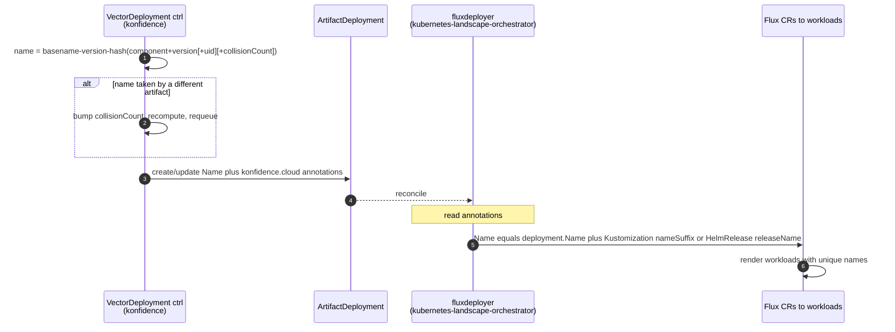

# ADR-0034: ArtifactDeployment and Flux resource naming

<AdrHeader />

## Context

Konfidence deploys an artifact by creating an `ArtifactDeployment` (in `konfidence`) that the fluxdeployer (in `kubernetes-landscape-orchestrator`) turns into Flux resources on the target cluster. The name of that `ArtifactDeployment` propagates into every Flux resource and, ultimately, into the workloads applied to the cluster.

The problem: **two deployments must never share a name that would make Flux overwrite live resources in place.** The same artifact can legitimately exist more than once on one landscape — a different version, or a separate instance per `VectorDeployment` when `allowReuse: false`. Each needs its own resource identity. The previous naming was neither guaranteed unique nor stable.

## Decision

### How the name is built

`konfidence` constructs the name via `ConstructArtifactDeploymentName`:

```
<component-basename>-<version>-<hash>
```

- **Hash** — `pkg/hash.Fnv(content, 10)`: FNV-1a rendered as **10 base36 characters** (`[0-9a-z]`), giving ~5.4 trillion values.
- **Hash input** — `component + version` when the artifact is reusable across vectors; `component + version + vectorDeploymentUID` when `allowReuse: false`, so each `VectorDeployment` gets a distinct instance.
- **Length** — the whole name is sanitised to a valid DNS-1123 label (`pkg/sanitize.DNSLabelName`) and kept ≤63 chars.

The name is **deterministic**: the same inputs always produce the same name. That is what makes reconciliation idempotent and lets a reusable artifact be safely shared across vectors.

The construction context is recorded on the `ArtifactDeployment` as `konfidence.cloud/*` annotations (`artifact-component`, `artifact-version`, `artifact-hash`, `allow-reuse`, and `vector-deployment-uid` when reuse is disabled). Downstream resources read these annotations rather than recomputing anything.

### How collisions are handled

When the computed name is already taken by an existing `ArtifactDeployment`, the controller decides whether that is intended reuse or a genuine clash by comparing the existing object's `konfidence.cloud/artifact-component` and `konfidence.cloud/artifact-version` annotations against what it expects:

- **Annotations match** → it is the *same* artifact. Sharing one `ArtifactDeployment` is exactly what reuse is meant to do — the controller simply adopts and updates it. This is designed behaviour, not a fault.
- **Annotations differ** → two *different* artifacts hashed to the same short name. That is a real collision.

On a real collision Konfidence **detects and recovers**, mirroring how Kubernetes handles `Deployment` → `ReplicaSet` hash clashes:

1. It emits an `ArtifactDeploymentHashCollision` warning event, records a `collisionCount` for that component on the `VectorDeployment` status, increments it, and folds the count into the hash input — producing a fresh, still-deterministic name.
2. It requeues and retries. `collisionCount == 0` reproduces the original algorithm exactly, so existing names are never disturbed by this mechanism.
3. After 5 consecutive collisions the controller fails loudly rather than looping forever — that many re-salts still clashing is a bug, not bad luck.

A real collision is therefore a self-healing operational event, not a fatal one, and the common case (creation, or intended reuse) is byte-identical to plain hashing.

### How Flux resources are named

The fluxdeployer names every Flux resource **exactly `ArtifactDeployment.Name`** — `konfidence` already produced a valid DNS-1123 label, so no re-sanitisation happens:

- `HelmRepository`, `HelmRelease` (and `HelmRelease.spec.releaseName`) → `deployment.Name`
- `OCIRepository`, `Kustomization` (and its `sourceRef.Name`) → `deployment.Name`
- All Flux resources carry the label `konfidence.cloud/artifact-deployment: <deployment.Name>`.

### How per-instance uniqueness reaches the workloads

The `ArtifactDeployment` name distinguishes *deployments*; the following makes the *rendered workloads* unique:

- **Kustomize** — the deployer sets Flux `Kustomization.spec.nameSuffix` to `-<version>-<hash>` (falling back to `-<hash>` when length-constrained). This is a native Flux field applied at render time and is **owned by the deployer**: any `nameSuffix` the author sets in their own `kustomization.yaml` is overwritten and discarded (see implications).
- **Helm** — the deployer sets `HelmRelease.spec.releaseName` to the deployment name. Charts that derive names from `.Release.Name` inherit uniqueness automatically.

## Implications for users

Authors of artifacts consumed by the Kubernetes Deployer must follow a few rules (see the [Kubernetes Deployer reference docs](https://github.com/konfidence-project/konfidence-docs/blob/main/src/docs/develop-integrate/deployers/kubernetes.md)):

- **Kustomize bundles** must not set `nameSuffix` or `namespace` in their `kustomization.yaml` — the deployer overwrites both, and any author-set value is discarded.
- **Helm charts** should derive every `metadata.name` from <code v-pre>{{ .Release.Name }}</code>. Hard-coded resource names collide when the same chart is deployed at two versions, or by two `VectorDeployment`s with `allowReuse: false`.
- **Anything in the bundle/chart is duplicated per instance.** Resources for which duplicate application is meaningless (e.g. `CustomResourceDefinition`) must be delivered through a separate path.
- Deploying the same component at a new version, or under a new vector with reuse disabled, always yields a distinct name and a distinct set of cluster resources — the old deployment is never silently overwritten.

## Alternatives considered

- **Random suffix** — guarantees uniqueness but breaks determinism, and with it idempotent reconciliation and cross-vector reuse. Rejected in favour of a deterministic hash plus collision recovery.
- **Rely on the author's own Kustomization `nameSuffix` for uniqueness** — rejected: it is optional, not guaranteed unique per instance, and would leave uniqueness in the author's hands. Instead the deployer owns `nameSuffix` outright; the author must not set it.
- **Rename the `HelmRelease` to force uniqueness** — insufficient on its own; only works for charts honouring `.Release.Name`.
- **Loud-fail on collision without recovery** — simpler, but leaves a deployment permanently stuck. Rejected in favour of the `collisionCount` recovery above.

## Consequences

- **Deterministic & idempotent** — same inputs → same name → diff-free reconciliation across both repos, and safe reuse of one deployment across vectors.
- **Debuggable** — names carry the component and version; the trailing hash matches the `artifact-hash` annotation and is grep-friendly.
- **Clean repo split** (ADR-0027) — `konfidence` owns the naming algorithm and sanitisation; `kubernetes-landscape-orchestrator` trusts the name verbatim and reads context from annotations, owning no hash logic.
- **Known limitation (deferred)** — a rare interleaving of artifact reuse and deletion of a colliding "squatter" can still produce a duplicate; probability is effectively nil and a fix is not warranted yet.

## Sequence



## Implementation references

- `konfidence`:
  - `pkg/hash/fnv.go` — `Fnv(content, 10)`
  - `pkg/controller/const.go` — the `konfidence.cloud/*` annotation keys
  - `internal/vectordeployment/internal/controller/util.go` — `ConstructArtifactDeploymentName`
  - `internal/vectordeployment/internal/controller/vectordeployment_controller.go` — `collisionCount` recovery, annotation writes
- `kubernetes-landscape-orchestrator`:
  - `internal/fluxdeployer/internal/fluxcd/reconciler/utils.go` — `buildKustomizationNameSuffix`
  - `internal/fluxdeployer/internal/controller/{helm,kustomize}_artifactdeployment_controller.go` — reject `>1` OCM resource of a type (`MultipleHelmChartResources` / `MultipleKustomizeResources`)
