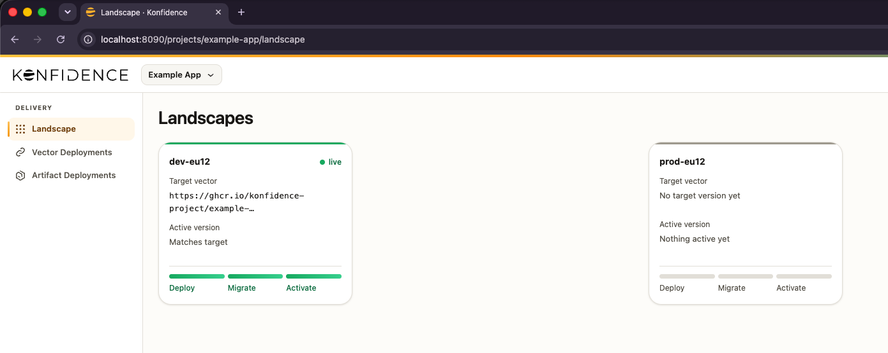

# Deliver an application

Use the prepared Example App to follow a delivery from development to production. You’ll create the required Konfidence resources, deploy one [vector](../reference/glossary.md#vector) to development, and approve its promotion to production.

The application artifacts and images are public, so you do not need registry credentials. By the end of the guide, the same vector will be running in development and production without being rebuilt.

## Before you begin

Complete these steps before starting the guide:

- Complete the [Quickstart](./quickstart.md) and keep its `konfidence-quickstart` cluster running.
- [Install the `kden` CLI](./install-cli.md).

Keep the port-forward from the Quickstart running. If you stopped it, start it again in a separate terminal:

```bash
kubectl -n konfidence-system port-forward svc/konfidence-api 8090:8090
```

## Prepare the demo environment

### Create the project

Create the Example App project, then wait until Konfidence has created its namespace:

```bash
kubectl apply -k 'https://github.com/konfidence-project/example-app/hack/quickstart/project?ref=main'
kubectl wait --for=jsonpath='{.status.conditions[?(@.type=="NamespaceReady")].status}'=True \
  project/example-app --timeout=60s
```

### Create the landscapes

Next, create the `dev` and `prod` landscapes. Each landscape receives its own namespace:

```bash
kubectl apply -k 'https://github.com/konfidence-project/example-app/hack/quickstart/landscapes?ref=main'
kubectl -n kden-p-example-app wait --for=jsonpath='{.status.conditions[?(@.type=="NamespaceReady")].status}'=True \
  landscape/dev landscape/prod --timeout=60s
```

### Create the delivery environment

Apply the prepared delivery environment. It creates the `dev-eu12` stage in the `dev` landscape and `prod-eu12` in `prod`, along with the resources needed to deploy the Example App and promote it between them.

```bash
kubectl apply -k 'https://github.com/konfidence-project/example-app/hack/quickstart/environment?ref=main'
```

The Example App reads its vector data from a Vector Data Service in each landscape namespace. Install it in `kden-l-dev` and `kden-l-prod`:

```bash
for ns in kden-l-dev kden-l-prod; do
  helm upgrade --install vector-data-service oci://ghcr.io/konfidence-project/charts/vector-data-service \
    --version 0.0.0-4f194adf3c2e211514d41c59d1a446275bb093e3 \
    --namespace "$ns" --wait
done
```

### Wait for the development deployment

The environment assigns the published Example App vector to `dev-eu12`, which starts the development deployment. Watch the `ACTIVE-VERSION` column:

```bash
kubectl -n kden-l-dev get stage dev-eu12 -w
```

Once `ACTIVE-VERSION` contains a value, the application is running in development. Press `Ctrl`+`C` to stop watching.

::: details Troubleshoot a deployment that does not become active

Inspect the pods and recent events to identify scheduling or rollout errors:

```bash
kubectl -n kden-l-dev get pods
kubectl -n kden-l-dev get events --sort-by=.lastTimestamp
```

For further checks, see [Stage troubleshooting](../deploy-operate/manage-delivery/stages.md#troubleshooting).

:::

### Check the starting state

Open the [local dashboard](http://localhost:8090), sign in as **Local Admin** if prompted, and select **Example App**. The **Landscapes** view shows the result of the setup:

- `dev-eu12` is live with the Example App.
- `prod-eu12` has no target version.



## Promote to production

The environment created a [promotion](../reference/glossary.md#promotion) that connects `dev-eu12` to `prod-eu12`. Use the `kden` CLI to inspect and approve it.

### Sign in to the CLI

The CLI uses its own session. Run the following command to sign in:

```bash
kden login
```

Complete the **Local Admin** sign-in in your browser. The CLI connects to `http://localhost:8090` by default.

### Inspect the waiting promotion

List the promotions for the Example App. The output should contain one promotion in the `Waiting` state:

```console
$ kden vector-promotion list -p example-app --output pretty
dev-to-prod (dev-eu12 → prod-eu12)
 ID              Source     Target      Vector                           Status
 dev-to-prod-1   dev-eu12   prod-eu12   https://ghcr.io/konfidence-pr…   Waiting
```

`dev-to-prod-1` connects the development and production [stages](../reference/glossary.md#stage). Production remains unchanged while the promotion is waiting for approval.

### Approve the promotion

Approve the waiting promotion using the ID from the previous output:

```bash
kden vector-promotion approve dev-to-prod-1 -p example-app
```

::: warning
Use the promotion ID (`dev-to-prod-1`), not the configuration ID (`dev-to-prod`).
:::

List the promotions again to confirm that the approval succeeded:

```console
$ kden vector-promotion list -p example-app --output pretty
dev-to-prod (dev-eu12 → prod-eu12)
 ID              Source     Target      Vector                           Status
 dev-to-prod-1   dev-eu12   prod-eu12   https://ghcr.io/konfidence-pr…   Succeeded
```

The `Succeeded` status confirms that `prod-eu12` now selects the promoted vector. The production rollout may still be in progress.

### Wait for production

Check the production stage. If it is not ready yet, wait and run the command again:

```console
$ kden stage list -p example-app -l prod --output pretty
 ID          Name        Landscape   Active Version            Status
 prod-eu12   prod-eu12   prod        prod-eu12-7f3k2m9d4qxzc   Ready
```

Once the status is `Ready`, the application is running in production. For rollout problems, see [Stage troubleshooting](../deploy-operate/manage-delivery/stages.md#troubleshooting).

### Confirm the delivered vector

List the vector deployments to compare development and production:

```bash
kden vector-deployment list -p example-app --output pretty
```

The output should contain ready deployments for both `dev-eu12` and `prod-eu12`. Their **Vector** values are identical: Konfidence promoted the application version that ran in development instead of rebuilding it for production.

## Optional: verify service-to-service communication

The Quickstart does not expose the deployed application through an ingress gateway or route requests by vector. You can use port-forwarding to verify that the `interviews` service discovers and calls the `candidates` service in the same vector context.

::: details Run the optional test

Port-forwarding bypasses the ingress gateway, so you must supply `X-Vector-ID` yourself.

1. In a new terminal, find the production `candidates` Service and forward it:

   ```bash
   CANDIDATES_SERVICE=$(kubectl -n kden-l-prod get service -l app=candidates -o name)
   kubectl -n kden-l-prod port-forward "$CANDIDATES_SERVICE" 18091:80
   ```

2. Keep the command running. In another terminal, forward the `interviews` Service:

   ```bash
   INTERVIEWS_SERVICE=$(kubectl -n kden-l-prod get service -l app.kubernetes.io/name=interviews -o name)
   kubectl -n kden-l-prod port-forward "$INTERVIEWS_SERVICE" 18092:80
   ```

3. Run the remaining commands in a third terminal. Get the runtime vector ID from the active production stage version:

   ```bash
   VECTOR_ID=$(kubectl -n kden-l-prod get stage prod-eu12 \
     -o jsonpath='{.status.activeStageVersion.name}')
   echo "$VECTOR_ID"
   ```

   The output is a name such as `prod-eu12-7f3k2m9d4qxzc`. Use the value from your cluster, not the registry reference beginning with `https://ghcr.io/`.

4. Create a candidate with synthetic data:

   ```bash
   curl --include --silent --show-error http://localhost:18091/candidates \
     -H 'Content-Type: application/json' \
     -H "X-Vector-ID: $VECTOR_ID" \
     --data '{"name":"Example Candidate","email":"candidate@example.invalid"}'
   ```

   Expect HTTP `201` and a JSON object containing `id`, `name`, and `email`. Copy the returned `id` into this variable:

   ```bash
   CANDIDATE_ID='<candidate-id>'
   ```

5. Book a phone interview for the candidate:

   ```bash
   curl --include --silent --show-error http://localhost:18092/interviews \
     -H 'Content-Type: application/json' \
     -H "X-Vector-ID: $VECTOR_ID" \
     --data "{\"candidateId\":\"$CANDIDATE_ID\",\"slotTime\":\"2030-01-15T10:00:00Z\",\"slotType\":\"phone\"}"
   ```

   Expect HTTP `201` and the booking details. The `interviews` service resolved the `candidates` service from the vector's deployment results and forwarded `X-Vector-ID` on its internal request.

Stop the two application port-forwards with `Ctrl`+`C` when you are finished. The records remain in the local example database until you [delete the Quickstart cluster](./quickstart.md#clean-up).

:::

## Next steps

Read [Delivery flow](../core-concepts/delivery-flow.md) to learn how promotions connect stages and control which vector each stage selects.

When you’re finished exploring Konfidence, follow the [Quickstart cleanup](./quickstart.md#clean-up) to delete the local cluster.
