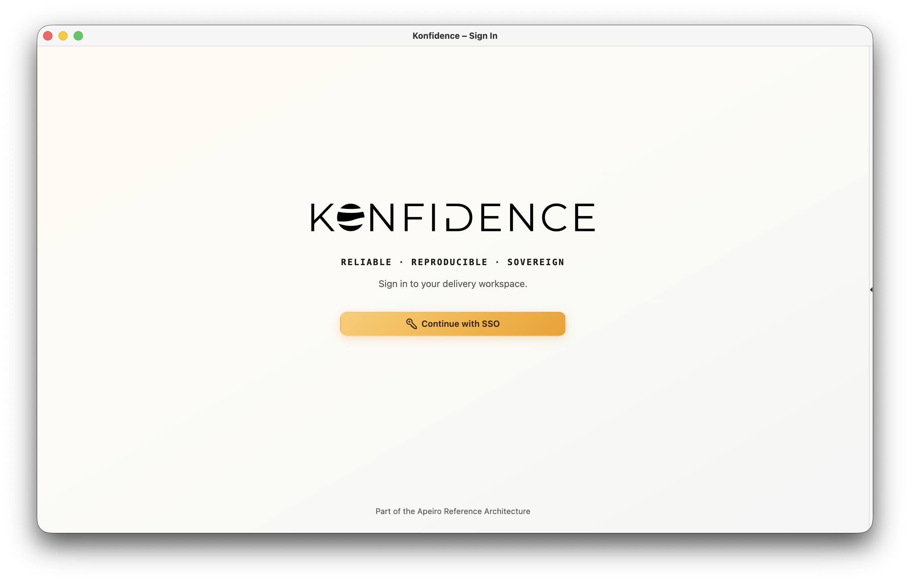

# Quickstart

Konfidence is a software delivery framework for microservice-based software-as-a-service applications. It helps teams deliver complex applications consistently across multiple environments by using immutable, versioned application vectors and a structured release model.

Before you install Konfidence, it helps to know what this setup is for: teams promote the same verified application version across environments instead of rebuilding or reconfiguring it for each deployment. This makes releases easier to reason about as systems, teams, and release frequency grow.

## Cluster setup

Use the Quickstart script to create a local Kubernetes cluster with Konfidence installed. By the end of this setup, you’ll have a running instance and access to its dashboard.

Before you begin, install the following tools:

- [Docker](https://docs.docker.com/get-started/get-docker/) — make sure the Docker engine is running.
- [kind](https://kind.sigs.k8s.io/docs/user/quick-start/#installation) — creates the local Kubernetes cluster.
- [kubectl](https://kubernetes.io/docs/tasks/tools/) — lets you interact with the cluster.
- [Helm](https://helm.sh/docs/intro/install/) — installs the Konfidence components.

Run the installation:

```bash
curl -fsSL https://raw.githubusercontent.com/konfidence-project/konfidence/main/hack/quickstart/quickstart.sh | sh
```

The script creates a kind cluster named `konfidence-quickstart` and selects it as your current kubeconfig context. It then installs these components in order:

1. **Flux** — controllers that reconcile Helm and Kustomize deployments.
2. **Konfidence** — the controller and API, which also serves the dashboard.
3. **Kubernetes Landscape Orchestrator** — uses Flux to deploy Helm charts and Kustomize configurations for Konfidence.
4. **Vector Data Service** — lets applications read configuration and deployment results for a vector at runtime.

The script waits for the Flux deployments and Helm releases to become ready. Running it again reuses the cluster and updates the existing installation.

If you’d like to explore how the installation works or try the steps manually, take a look at the [Quickstart script](https://github.com/konfidence-project/konfidence/blob/main/hack/quickstart/quickstart.sh). Its comments explain each step and the components being installed.

Once the installation completes, check the Konfidence deployments:

```bash
kubectl get deployments -n konfidence-system
```

You should see output similar to this:

```text
NAME                                READY   UP-TO-DATE   AVAILABLE   AGE
konfidence                          1/1     1            1           61s
konfidence-api                      1/1     1            1           61s
kubernetes-landscape-orchestrator   1/1     1            1           42s
vector-data-service                 1/1     1            1           27s
```

The `READY` column should show that all replicas are ready.

Check that the Flux controllers are also ready:

```bash
kubectl get deployments -n flux-system
```

For every Flux deployment, the `READY` column should show that all replicas are ready.

## Deploy the example application

The [example application](https://github.com/konfidence-project/example-app) publishes its artifacts to a public registry. Apply the prepared resources in order — each set waits for the namespaces the previous one creates.

Create the project:

```bash
kubectl apply -k https://github.com/konfidence-project/example-app/hack/quickstart/project?ref=main
kubectl wait --for=jsonpath='{.status.conditions[?(@.type=="NamespaceReady")].status}'=True \
  project/example-app --timeout=60s
```

Create the `dev` and `prod` landscapes:

```bash
kubectl apply -k https://github.com/konfidence-project/example-app/hack/quickstart/landscapes?ref=main
kubectl -n kden-p-example-app wait --for=jsonpath='{.status.conditions[?(@.type=="NamespaceReady")].status}'=True \
  landscape/dev landscape/prod --timeout=60s
```

Create the stages, deployment targets, database, and promotion config:

```bash
kubectl apply -k https://github.com/konfidence-project/example-app/hack/quickstart/environment?ref=main
```

Install the vector-data-service into each landscape namespace:

```bash
for ns in kden-l-dev kden-l-prod; do
  helm upgrade --install vector-data-service oci://ghcr.io/konfidence-project/charts/vector-data-service \
    --version 0.0.0-4f194adf3c2e211514d41c59d1a446275bb093e3 \
    --namespace "$ns" --wait
done
```

::: warning
The per-landscape vector-data-service install is temporary until the platform provisions it automatically for each landscape.
:::

The example application deploys to the `dev-eu12` stage. Watch it become ready:

```bash
kubectl -n kden-l-dev get stage dev-eu12 -w
```

## Open the dashboard

The local Quickstart does not yet include an ingress setup for the dashboard. To access it from your computer, use port-forwarding to connect to the Konfidence API, which also serves the dashboard:

```bash
kubectl -n konfidence-system port-forward svc/konfidence-api 8090:8090
```

Keep this command running and open `http://localhost:8090` in your browser. You should see the Konfidence sign-in page:



Select **Continue with SSO** to sign in as **Local Admin**. No external identity provider is required.

Sessions are stored in memory, so you’ll need to sign in again if the API restarts.

Select the **Example App** project to see the application running in `dev-eu12` and a promotion to `prod-eu12` waiting for approval.

## Clean up

Keep the cluster running if you’re continuing with **Deliver an application**. When you’re finished exploring Konfidence, stop the port-forward with `Ctrl+C` and remove the cluster:

```bash
kind delete cluster --name konfidence-quickstart
```

This deletes the `konfidence-quickstart` cluster and all workloads and data stored in it.

## Next steps

Your local Konfidence instance is ready. Continue with [Deliver an application](/docs/getting-started/deliver-an-application) to run a sample application in development and approve its promotion to production.
